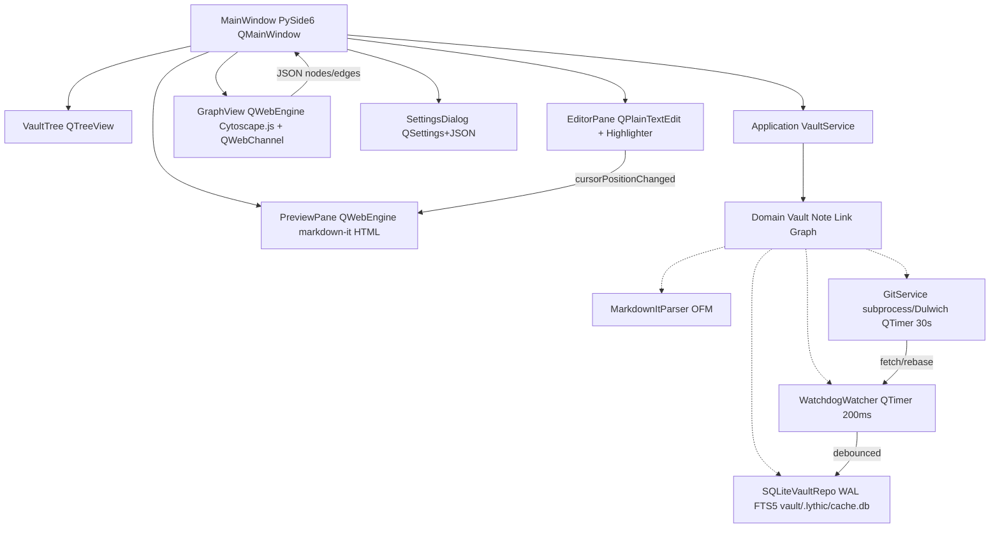

# Lythic — Obsidian 1:1 Clone in Python (PySide6) + Obsidian Plugin

> **Local-first vault (`vault/*.md` plain files) + live graph + git sync — Obsidian file-compat, native desktop.**
> Two surfaces, one vault: **Obsidian plugin** (`src/main.ts`) for inside Obsidian, and **standalone PySide6 app** (`lythic/`) that opens the same `vault/` folder with no conversion.


## Screenshots

| 4-Pane App (Dracula) | Knowledge Graph (Cytoscape.js) | Preview (Glass Design) |
|:---:|:---:|:---:|
|  |  |  |

Built from `Tools_AI-MCP` starter-pack (`opencode.json` + 7 agents + 8 commands + 5 skills + `superpowers@6.3.0`) — see `docs/adr/ADR-001-lythic-python-clone.md`.

**Remotes:** `origin → https://github.com/AliNikkhah2001/Lythic.git` + `legacy → https://github.com/AliNikkhah2001/Lithic_note-taking-system.git` (both pushed `main` + `feat/lythic-m1-scaffold`, PR https://github.com/AliNikkhah2001/Lythic/pull/1).

---

## ✨ What it does

**1:1 Obsidian subsystems (12) — all milestones M1-M10 complete:**

| # | Obsidian | Lythic Python (`lythic/`) | Milestone | Status |
|---|----------|---------------------------|-----------|--------|
| 1 | **Vault** — folder of `.md` + `vault/.obsidian/*.json` | `domain/vault.py:Vault` + `watchdog>=4.0` + `QTimer 200ms` | M1 | ✅ |
| 2 | **OFM Markdown** — `---YAML---`, `[[wiki]]` `[[a#heading\|alias]]` `![[embed]]`, `#tag/#nested`, `> [!NOTE]` callouts | `infrastructure/markdown_parser.py:ObsidianMarkdownParser` = `markdown-it-py` + `python-frontmatter` | M1 | ✅ |
| 3 | **Links** — outgoing / backlinks / unlinked mentions | `domain/vault.py:WikiLink` + `sqlite_repo.py:links` FTS5 | M1 | ✅ |
| 4 | **Explorer** — tree rename/move/delete + FSEvents | `presentation/VaultTree.py:QTreeView+QFileSystemModel` | M1 | ✅ |
| 5 | **Editor** — QTextEdit + EditingToolbar 40+ cmds + CodeBlockHighlighter (Pygments) | `EditorPane.py:QTextEdit` + `EditingToolbar.py:QToolBar` + `CodeBlockHighlighter.py:QSyntaxHighlighter` | M5 | ✅ |
| 6 | **Search** — Quick Switcher, global regex, tag | `sqlite_repo.py:fts_notes` `FTS5 porter unicode61` | M1 | ✅ |
| 7 | **Graph** — force global/local 2-hop, filter/group/color by tag, Cytoscape.js + sigma.js WebGL at 10k | `GraphView.py:QWebEngine+Cytoscape.js` + `graph_channel.py:QThread LayoutWorker` + `networkx.spring_layout` | M2-M3 | ✅ |
| 8 | **Properties** — frontmatter table | `Note.frontmatter: dict` + `SettingsDialog` | M1 | ✅ |
| 9 | **Media** — image drag→vault + video poster | `MediaEmbed.py:QPixmap+QMediaPlayer` | M7 | ✅ |
| 10 | **Spreadsheet** — QTextTable + openpyxl | `SheetView.py:QTextTable+QStandardItemModel` | M7 | ✅ |
| 11 | **Settings** — QSettings + vault config + live theme preview | `SettingsDialog.py:SettingsManager` + `ThemeService` TOML→CSS + 4 themes (default/dracula/glassmorphism/tokyo-night) | M1+M9 | ✅ |
| 12 | **Sync** — `git status --porcelain`, `pull --rebase` | `SubprocessGitAdapter` + `DulwichGitAdapter` + `GitAutoSync QTimer 30s` + `keyring` + `pathspec` | M8 | ✅ |
| 13 | **Math/LaTeX** — `$$` KaTeX rendering | `latex_renderer.py:render_with_fallback` CDN+bundle | M6 | ✅ |
| 14 | **AI** — clean/style/summarize/fix-frontmatter | `ai_service.py:AIService` metis api.metisai.ir + offline heuristics | M10 | ✅ |
| 15 | **Design System** — hyper glassmorphism (css.glass 451★ + Hype4 + liquidGL) | `glass.css` + `tokens.css` 100+ vars + `components.css` + QSS Fusion native shell + `qss_builder.py` | M1+M9 | ✅ |

**Demo (headless, no display needed):**
```bash
python3 -m lythic.presentation.main --headless vault
# Lythic vault: vault (Qt: none)
# Indexed 2 notes → vault/.lythic/cache.db
# Graph: 4 nodes, 4 edges
# Search 'Lythic': ['vault/Demo Note.md', 'vault/Welcome to Lythic.md']
```

**Demo (GUI — 4-pane split, Dracula theme):**
```bash
python3 -m lythic.presentation.main vault
# Opens QMainWindow: VaultTree | Editor | Preview (glass) | Graph (Cytoscape.js)
# Status bar: 4n 4e 3 clusters cytoscape git:main Qt:PySide6
```
# Autonomous Knowledge Compiler for AI Chats

**Executive Summary:** We envision a **daemonized knowledge compiler** that continuously ingests AI chat transcripts (ChatGPT, Claude, Gemini/NotebookLM, local LLM logs, browser captures) and produces an **atomic, interlinked Markdown knowledge base** (e.g. Obsidian or Atomic notes). The system automates cleaning, chunking into “atomic” claims, de-duplication, entity linking, and graph assembly. Each atomic note carries metadata (frontmatter) for provenance, confidence, and relationships. The compiled vault remains portable Markdown (Obsidian/Logseq-compatible) and can be synced or queried by agents. This report surveys the required architecture, algorithms, libraries, and existing open-source projects, and proposes a roadmap. We reference designs like Karpathy’s LLM Wiki, the *Atomic Knowledge* protocol, and tools like Nexus AI chat importer and Obsidian-AI-Exporter as inspiration.

## Architecture & Pipeline

A robust architecture has several stages (see flowchart below): **Data Ingestion → Cleaning/Parsing → Atomic Extraction → Deduplication/Merge → Entity/Relation Extraction → Graph Construction → Output Vault**.  

- **Daemon & Adapters:** A background service (e.g. Python/Node) monitors sources and triggers ingestion. Adapters handle each source (ChatGPT export ZIP, Claude export, Gemini Notebook export, local logs, browser-extensions). For instance, Nexus AI’s CLI can import ChatGPT/Claude ZIPs into Obsidian. Browser extensions like *Obsidian AI Exporter* support “one-click” export of current ChatGPT/Gemini/Claude conversations via the Obsidian Local REST API.
- **Raw Store:** Raw ingested data (JSON, text, HTML) are kept immutable in a *raw* directory or database. This preserves the original transcripts for provenance. Karpathy’s LLM Wiki advocates keeping raw sources separate.
- **Cleaning/Parsing:** The compiler normalizes formats (e.g. converting HTML to Markdown, removing UI clutter, resolving timestamp formats). It may drop irrelevant metadata (e.g. system prompts) and ensure textual consistency. Known libraries (e.g. [Mercury Parser](https://github.com/postlight/mercury-parser) for web pages, HTML-to-markdown tools) can help here.
- **Atomic Extraction (Chunking & Claim Extraction):** The core is splitting transcripts into **atomic knowledge units**. This can combine rule-based and LLM methods. For example, one could use sentence tokenization (SpaCy, NLTK) to identify candidate chunks, then apply an LLM (GPT-4, Claude Code, etc.) with prompts to **summarize or extract “claims” or key points** from each message or exchange. Karpathy’s pattern extracts “key information” and integrates it into wiki pages. The *Atomic Knowledge* framework also envisions an agent “reads the source, extracts key takeaways, and updates wiki pages”. A hybrid approach might use semantic chunking (embedding-based clustering of related sentences) and then LLM paraphrasing.
- **Deduplication & Merge:** Newly extracted atoms must be checked against existing knowledge to avoid duplicates. Semantic similarity (using sentence embeddings, e.g. via [Sentence Transformers](https://github.com/UKPLab/sentence-transformers)) can flag near-duplicates. Exact duplicates can be merged; similar atoms may trigger a comparison step (automated or human-in-the-loop). The **Nexus plugin uses conversation IDs and message IDs to avoid duplicates**; for knowledge atoms, one can similarly tag or hash content. A vector DB (FAISS, ChromaDB, Weaviate, or even SQLite+embeddings) can help index and search existing atoms for overlaps.
- **Entity Resolution & Relations:** Each atomic note can include **entities and relationships**. Use NLP pipelines for named-entity recognition (SpaCy, Hugging Face NER models) and entity linking (e.g. linking to Wikipedia or Wikidata via tools like [BLINK](https://github.com/facebookresearch/BLINK) or HuggingFace’s `dbmdz/bert-base-german-cased-ner-conll18` for general NER). Relational extraction libraries like *Relik* can identify predicates between entities. For example, Relik can “map entities in text to Wikipedia and extract relationships”. Coreference resolution (SpaCy’s *coreferee* or AllenNLP) can consolidate references (e.g. “it” → product name) to improve linking.
- **Typed Metadata & Trust:** We include YAML frontmatter (see below) for each note, containing fields like `title`, `date`, `tags`, `source`, `entities`, `confidence`, etc. Tools like *Claude-to-Obsidian* export add frontmatter (title, date, messageCount, model, etc.). We propose adding fields like `type: claim/entity/procedure`, `id:`, and `confidence:` to help maintenance. The system tracks trust metadata (e.g. flagged contradictions or uncertain claims) and may include a review status (as in Atomic Knowledge’s `meta/candidates/` buffer).

**Maintenance/Updates:** The daemon reruns periodically. New transcripts are ingested and new atoms created. Existing atoms may be refreshed (e.g. if underlying chat is edited). A maintenance loop (drawing from *Atomic Knowledge* and Karpathy) could periodically lint the graph: identify stale or orphaned atoms, contradictions, or outdated links.

```mermaid
flowchart LR
  A[ChatGPT/Claude/Gemini Exports<br/>Local LLM Logs<br/>Browser Captures] --> B[Raw Store/Queue]
  B --> C[Cleaning & Parsing]
  C --> D[Atomic Extraction<br/>(LLM + NLP chunking)]
  D --> E[Deduplication & Merge]
  E --> F[Entity/Relation Extraction]
  F --> G[Link & Graph Construction]
  G --> H[Output Vault (Markdown Notes)]
  style A fill:#ddf,stroke:#333,stroke-width:1px
  style H fill:#dfd,stroke:#333,stroke-width:1px
```

## Data Models & Metadata

Each **atomic note** is a Markdown file with YAML frontmatter. Example frontmatter (inspired by Claude-to-Obsidian and Nexus) might be:

```markdown
---
id: atom-042
title: "Gradient Descent Convergence"
date: 2026-08-24
tags: [machine-learning, optimization]
source:
  - provider: ChatGPT
    conversation_id: "abc123..."
    message_index: 2
entities: [GradientDescent, ConvexFunction]
confidence: 0.9
---
**Claim:** Gradient descent converges linearly on strongly convex functions.
```

Fields explanation: `id` is a unique atom ID; `title`, `date`, `tags` for organization; `source` lists origins (with provider and chat metadata) to trace provenance; `entities` lists extracted entities; `confidence` scores extraction reliability. This aligns with Nexus plugin’s approach of rich frontmatter (plugin ID, timestamps, etc.) and Claude exporter’s enhanced metadata (title, messageCount, projectName, model). Keeping the frontmatter human- and machine-readable enables Obsidian plugins (Dataview, etc.) to query and filter atoms.

## Algorithms & Libraries

Key NLP tasks and tools include:

- **Text Chunking & Summarization:** Break dialogue into segments. Use sentence or paragraph splitting (SpaCy, NLTK) and then summarize or extract facts with LLMs (GPT-4, Claude, OpenAI’s text models) via prompts. Non-LLM libs like `sumy` (for extractive summarization) or HuggingFace models (PEGASUS, T5) can assist initial chunking.
- **Claim Extraction:** Techniques from fact-checking research can be adapted. While no dominant open-source “claim extractor” exists, one can prompt LLMs to output bullet-point takeaways. The *Atomic Knowledge* and Karpathy patterns implicitly perform claim extraction. For evaluation, one could compare extracted claims to gold data (if available) measuring precision/recall.
- **Coreference Resolution:** Use SpaCy’s *coreferee* or AllenNLP’s Coref model to resolve pronouns/aliases (e.g. “it” → “the algorithm”). For instance, SpaCy’s Coreferee can cluster references and rewrite text accordingly.
- **Semantic Similarity & Clustering:** Compute embeddings (using e.g. Hugging Face `sentence-transformers/all-MiniLM-L6-v2`) for atoms. Scikit-learn or HDBSCAN can cluster similar atoms or detect duplicates. Embedding-based nearest-neighbor search (via FAISS, Annoy, or ChromaDB) identifies semantically similar content for merging.
- **Entity Linking:** Named entities (people, places, tools) recognized by SpaCy or custom models can be linked to Wikipedia/DBpedia using libraries like [relik](https://github.com/epwalsh/Relik) or Blink, as shown in the Neo4j blog.
- **Relationship Extraction:** Use Relik’s RE models or Stanford OpenIE to find predicates between entities. For example, Relik can tag an LLM chat to `(Entity → RELATIONSHIP → Entity)` triplets. This populates edges in the semantic graph.
- **Embedding Storage/Vector DB:** For search and dedupe, use a vector database (FAISS, ChromaDB, Pinecone, Weaviate) or even SQLite with vector support (e.g. using SQLite-vec). The knowledge-base-server uses SQLite FTS5 for text search and local HuggingFace embeddings for semantic search.
- **Graph Construction:** Libraries like NetworkX or Neo4j can store the resulting knowledge graph. Graphiti (open source) is a context-graph engine with temporal support. If heavy graph querying is needed, Neo4j or other graph DBs could be used; otherwise simple node/link structures (markdown links) suffice for an Obsidian vault.

## Open-Source Tools & Projects

Numerous OSS projects can be re-used or serve as inspiration (see table below):

| Project (Link) | Key Features | Gaps/Notes | License | Maturity |
|---|---|---|---|---|
| **Nexus AI Chat Importer** (Superkikim) | Obsidian plugin + CLI; imports ChatGPT/Claude/Mistral/Perplexity exports into Markdown; callouts per role; rich frontmatter for conv metadata; dedup, append mode | Focuses on raw conversation transcripts, not knowledge extraction or graph building | MIT | ⭐️⭐️⭐️ (active plugin, 1.5k forks) |
| **Obsidian AI Exporter** (sho7650) | Chrome extension exporting ChatGPT/Gemini/Claude to Obsidian via REST API; supports deep-research threads, images, artifacts, YAML metadata | Designed for on-demand export; not an autonomous daemon | MIT | ⭐️⭐️⭐️ (mature, regularly updated) |
| **Atomic** (kenforthewin) | Personal KB app: auto-chunks Markdown notes (“atoms”), vector search (sqlite-vec), AI-generated wiki synthesis, canvas graph view, agent chat, RSS/web capture, multi-AI support | Doesn’t natively ingest chat logs (notes-focused) | MIT | ⭐️⭐️⭐️⭐️ (active, used widely) |
| **claude-obsidian** (AgriciDaniel) | Local-first knowledge system: ingest sources, build linked, source-cited vault; agent-driven ingestion and retrieval; provenance/trust tracking | Complex setup; focused on Claude and Agent Skills; steep learning curve | MIT | ⭐️⭐️ (emerging, experimental) |
| **Atomic Knowledge** (Nimo1987) | Knowledge-base protocol: raw sources → maintained wiki pages; clear workflows (ingest, query, writeback, maintenance); example schemas | Framework/protocol, not a packaged tool; requires agent code | MIT | ⭐️ (conceptual, prototype-level) |
| **Knowledge-Base-Server** (willynikes2) | Multi-agent KB with SQLite FTS+semantic search, Obsidian sync, MCP server; agents (Claude/GPT/Gemini) share context; CLI setup wizard | More focus on agent context sharing than user-facing graph; server-heavy | MIT | ⭐️⭐️⭐️ (beta to stable) |
| **llmwiki-compiler** (atomicstrata) | Full LLM knowledge compiler: raw sources → typed Markdown wiki; citation tracking; hybrid retrieval; review/maintenance tools; CLI+SDK+UI; OKF export | Very comprehensive, but complex; learning curve high | MIT | ⭐️⭐️⭐️ (v1.0 released) |
| **Graphiti** (getzep) | Open-source temporal knowledge graph engine for agents; builds evolving entity-relations graphs with provenance (episodes) | More focused on temporal context graphs; not specific to chat transcripts or markdown | Apache-2.0 | ⭐️⭐️⭐️ (active research project) |

Each of these addresses parts of the problem. For example, **Nexus** and **AI Exporter** handle ingestion and formatting into Markdown, **Atomic** provides a semantic-web UI, and **llmwiki-compiler** embodies the full compile-into-wiki vision. We would likely **combine** approaches: use tools like Nexus as ingestion adapters, then apply an atomic extraction engine (perhaps inspired by llmwiki) to generate new notes.

## Connectors & APIs

- **ChatGPT (OpenAI):** No public history API; use the web export (Settings → Data Controls → Export Data) which produces a ZIP of chats. Alternatively, use the OpenAI Chat Completion API to replay conversations (if logs maintained).
- **Claude (Anthropic):** Similar approach: UI export (Settings → Privacy → Export Data) yields a zip. Claude also has APIs, but these don’t provide past conversations. The *claude-export* browser script (ryanschiang) shows how to scrape and export current chat to Markdown.
- **Google Gemini/NotebookLM:** The Google Workspace data export tool can extract NotebookLM chat history. No general user API is provided. Chrome extensions (e.g. *NotebookLM Chat History Exporter*) can help capture transcripts.
- **Local LLMs:** If using an API or self-hosted model (e.g. via OpenAI, Anthropic, or open models like LLaMA), the application should log dialogues locally (simple JSON logs). No standard library, but one can build a wrapper to write each query/response to file.
- **Browser Capture Tools:** Chrome extensions and bookmarklets can automate grabbing chats. Examples: *Obsidian AI Exporter*, *ChatGPT2Notion/Claude-to-Obsidian*, or *ChatGPT/Gemini/Claude Export & Navigator*. Many exist (often paid apps) to copy chats to Markdown.

The compiler should include “connectors” to integrate with these flows: e.g. watch a Download folder for new export ZIPs (like Nexus does), or integrate with a Chrome extension’s Local API.

## Storage Options

- **Vault (Markdown files):** The core output is a folder (“vault”) of Markdown notes. Obsidian, Atomic, or Logseq vaults are just file directories. Files can be organized arbitrarily (e.g. by date, by topic). Example structure:
  ```
  vault/
    raw_exports/          # ZIPs or raw JSON sources
    archives/             # original chat transcripts
    atoms/                # generated atomic note files
    attachments/          # images or files from chats
    templates/            # (optional) static templates
  ```
- **SQLite/FTS:** A local SQLite database can index notes for full-text search (with FTS5) and store metadata. The knowledge-base-server uses SQLite FTS5 (with BM25) and a local MiniLM embedding index, enabling fast retrieval without cloud.
- **Vector Database:** For semantic search/dedup, open-source vector DBs like Chroma (on-disk or in-memory), FAISS or Milvus can be used. A hybrid approach (keyword + embedding) is recommended to balance precision.
- **Graph Database:** If a full semantic graph is needed, one could use Neo4j or Dgraph. However, for simplicity the “graph” can just be constituted by Markdown wikilinks and YAML relations.
- **Cloud Sync:** For multi-device or collaboration, an Obsidian-Git or Gitless Sync plugin can sync the vault to GitHub, ensuring backups and versioning.

## Integration & UX

- **Obsidian & Logseq:** Since output is Markdown, it integrates directly. Obsidian’s **Community Plugins** can further enhance functionality. For example, Nexus plugin itself is an Obsidian plugin. The Dataview plugin can query our YAML metadata. Obsidian’s Graph View will visualize interlinked notes (atomic “graph” appears as network).
- **Atomic.app:** The Atomic app expects “atoms” (notes) in its own format. The frontmatter scheme should be compatible (Atomic expects `title`, `tags`, etc). Since Atomic already auto-chunks and links, integration might require adapting to its conventions (or simply importing its output).
- **Logseq:** Uses org/Markdown. Our YAML frontmatter can map to Logseq block properties. Plugins like “Sync to Logseq” could bring in notes. The approach is similar.
- **Plugins:** One could build a custom Obsidian plugin that triggers compilation or updates the atomic graph as chat logs are added. Alternatively, run the compiler externally and have Obsidian auto-scan the vault. A Mermaid chart (above) or directed graph could show the pipeline. UI could include a dashboard report (like Nexus’s import report).
- **Command-Line & API:** As with Nexus’s CLI and llmwiki’s CLI, a command-line tool (`knowledge-compiler`) could allow headless operation and scheduling (cron, systemd). An HTTP REST API could expose status or allow push of raw data.

## Testing, QA & Metrics

We must ensure quality of extraction and manage vault growth:

- **Precision/Recall for Extraction:** Create a test suite where known dialogues produce expected atoms. Compare against a gold standard to compute precision (relevance of extracted claims) and recall (coverage of key ideas). Use metrics from information extraction (e.g. F1 score).
- **Graph Health:** Track metrics like number of nodes/edges, orphan pages (no links), average connectivity. Karpathy and llmwiki emphasize “knowledge accumulates” and contradictions flagged. One can measure how many atoms are unsupported (no source citation) or redundant.
- **Dedup Rate:** Percentage of newly generated atoms merged vs novel. Too many duplicates indicates a problem.
- **User Evaluation:** Periodically sample auto-generated notes for factuality (maybe using an LLM or human reviewer). Incorporate a “confidence” score from the LLM or classifier on each extraction.
- **Performance:** Measure time per ingestion cycle, and size of vault (to control bloat). The pipeline should be efficient enough to run incrementally (not re-reading all history).

## Security & Privacy

- **Local-First:** The system is self-hosted, storing all chat data and notes locally. It should not send user transcripts to external servers beyond what the user already does (e.g., interacting with ChatGPT). All processing is on-device (or user’s private server).
- **Encryption:** If vault sync to cloud is used, the vault folder could be encrypted (Obsidian’s Secure Inbox plugin or git-crypt). Credentials for APIs (OpenAI key, etc.) should be kept in environment variables or secure store.
- **GDPR/CCPA:** Since data often includes personal info, treat the vault as PII-sensitive. Provide options to purge sensitive atoms. The system should not expose data over the network unless explicitly configured (e.g. disable any public API endpoints by default).
- **Access Control:** If deployed on a server, use authentication. (Nexus and llmwiki CLI warn that exposing an API without auth is unsafe.)
- **Audit Trails:** The frontmatter/source logs provide traceability. Every atom links back to original chat content.

## Roadmap & MVP

**Milestones:** (Assuming a small team of devs)
1. **Phase 0 – Ingestion & Vault Setup:** Build adapters to load ChatGPT and Claude export files and output raw Markdown transcripts (e.g. repurpose Nexus importer or write a Python script). Ensure Obsidian or plain folder integration.
2. **Phase 1 – Atomic Splitting:** Integrate an LLM or heuristic to split transcripts into atomic notes. Initially, try simple rules (split user/assistant pairs into paragraphs) and wrap in callouts. Then refine using an LLM “bullet summarizer” prompt to create concise atoms.
3. **Phase 2 – Dedup & Entity Linking:** Compute embeddings for atoms, implement merge logic. Use SpaCy to tag entities in atoms. Experiment with fuzzy matching vs semantic search.
4. **Phase 3 – Graph Linking:** Link entities across atoms (create [[WikiLinks]] or YAML relations). Possibly auto-generate index pages for key entities (like llmwiki’s concepts).
5. **Phase 4 – UX & Integration:** Make the tool CLI-friendly and/or Obsidian-plugin-friendly (e.g. an “Auto-compile” command). Publish sample vault folder.
6. **Phase 5 – QA & Metrics:** Implement evaluation (precision/recall tests) and logging. Solicit user feedback and iterate.

**Tech Stack:** Python is a good choice for NLP (SpaCy, Hugging Face) and running LLM calls. Node/TypeScript could be used for CLI or GUI components (as Nexus and llmwiki do). Database: SQLite or simple files. Infrastructure: systemd service or cloud VM. UI: leverage existing editors (Obsidian) rather than building one.

## Sample Output

**Example Folder Structure:**  
```
MyVault/
├─ raw_exports/             # downloaded chat exports (ZIPs, JSON)
├─ conversations/           # imported transcript notes
│   ├─ ChatGPT-2026-08-22.md
│   └─ Claude-2026-08-20.md
├─ atoms/                   # generated atomic notes
│   ├─ atom-001-gradient-descent.md
│   ├─ atom-002-binary-search.md
│   └─ atom-003-backtracking.md
├─ attachments/             # images/files from chats
├─ templates/
└─ README.md                # explains vault usage
```

**Sample Atomic Note (`atoms/atom-001-gradient-descent.md`):**
```markdown
---
id: atom-001
title: "Gradient Descent Convergence Rate"
date: 2026-08-24
tags: [optimization, machine-learning]
source:
  - provider: ChatGPT
    conversation_id: "xyz789"
    message_index: 3
entities: [GradientDescent, ConvexFunction]
confidence: 0.92
---
**Claim:** On strongly convex quadratic functions, gradient descent converges linearly (exponentially fast). This is because the function’s condition number bounds the decay rate of error. In practice, the learning rate must be ≤2/(max eigenvalue) for convergence.
```

This note is **atomic** (single claim), cites its source conversation, and is tagged for search. Such notes can be automatically created from chat transcripts via LLM prompting.

## Mermaid Pipeline Diagram

```mermaid
flowchart LR
  A[Ingest: ChatGPT/Claude/Gemini exports,<br/>Local LLM logs, Browser captures]
  A --> B[Raw Store (immutable transcripts/JSON)]
  B --> C[Clean & Preprocess (Markdownify, trim)]
  C --> D[Atomic Extract<br/>(chunking & LLM summarization)]
  D --> E[Deduplication & Merge (embeddings, hashing)]
  E --> F[Entity Recognition & Linking<br/>Relationship Extraction]
  F --> G[Graph Assembly<br/>(link notes, build index)]
  G --> H[Output Vault: Markdown notes (Obsidian/Logseq)]
```

**Legend:** Each box is a pipeline stage. The system continuously loops new items (solid arrow is main flow). (Mermaid code above can be rendered to visualize this pipeline.)

## Risks & Challenges

- **Provider Format Changes:** As Nexus warns, chat export formats are unofficial and can change, breaking parsers. Mitigation: write robust parsers or monitor for changes, use JSON when possible.
- **LLM Hallucinations:** Automated extraction/summarization may hallucinate. Care needed: always attach source citations and confidence. Possibly require a human review step for important claims.
- **Data Overload:** Large chat archives could produce many atoms. Need policies to trim or archive old/chaff content. Possibly prioritize chats by relevance.
- **Complexity:** Building a truly autonomous compiler is ambitious. A minimal viable product (MVP) might drop advanced features (trust gates, typed relations) initially.
- **Privacy:** Chats often contain private info. Users must trust the system not to leak it. Keep processing offline and consider encryption if syncing.
- **Version Control:** Editing or deleting atoms must propagate (Nexus handles migrating folder changes). Our system should handle re-ingestion and merges carefully.

In summary, an autonomous knowledge compiler is feasible by integrating existing tools: chat ingestors (Obsidian plugins, browser ext.), NLP/LLM pipelines (embedding/clustering, claim extraction), and knowledge management frameworks (Atomic, llmwiki). The vision aligns with recent thought leadership on LLM-powered second brains. By combining a persistent Markdown vault with LLM-driven processing, one can create a self-maintaining personal knowledge graph built from one’s own AI interactions. **Sources:** Karpathy’s LLM Wiki, Atomic Knowledge spec, Nexus AI importer docs, Obsidian-AI-Exporter README, Atomic app README, and Atomicstrata’s llmwiki , among others (see table).
---

## 🏗️ Architecture (ADR-001)

**Decision `docs/adr/ADR-001-lythic-python-clone.md:43`:** `PySide6>=6.7 LGPL` + `qt_compat.py` shim. Rejects `PyQt6 GPL $550` (viral vs `package.json:17` MIT) and `Electron 2× RAM`.

**10 sub-decisions:**

1. PySide6 LGPL (`qt_compat.py` `PySide6→PyQt6→dummy`, CI `grep -r pyqtSignal → fail`)
2. Editor `QPlainTextEdit+QSyntaxHighlighter` + `QWebEngineView` preview (reject `QScintilla GPL`)
3. `markdown-it-py` + `python-frontmatter` (reject `python-markdown` not CommonMark)
4. `watchdog` + `QTimer 200ms` (reject `QFileSystemWatcher` 4096fd)
5. `Cytoscape.js` via `QWebChannel` + `networkx.spring_layout` (reject `QGraphicsScene` physics)
6. `subprocess git (QProcess)` + `Dulwich` fallback (reject `GitPython` leaks) + `keyring/pathspec`
7. `sqlite3` `WAL+FTS5+JSON1` at `vault/.lythic/cache.db` gitignored (`files/links/tags/fts_notes`, `PRAGMA user_version`)
8. `PyInstaller tools/build.spec` 120MB + `codesign/notary` (reject Briefcase/Nuitka)
9. `QSettings` + `vault/.lythic/config.json` + `QSS Fusion` dark
10. `pytest+pytest-qt+syrupy` + `ruff/mypy --strict` 80% (95% indexer), pyramid 70/20/10

**Layered `AGENTS.md:31` `presentation → application → domain → infrastructure` (hexagonal, no cycles):**



`ADR-002` (deferred): vault intelligence embeddings (`sentence-transformers` + `sqlite-vec` + `annoy`).

---

## Project Structure

```
Lythic/                               # repo root (Obsidian plugin + Python clone)
├── manifest.json                    # plugin id:lythic v0.1.0
├── package.json                     # npm: dev/build/lint/typecheck/test
├── src/
│   ├── main.ts                      # LythicPlugin (Obsidian ribbon + commands)
│   └── settings.ts                  # LythicSettings interface
├── vault/
│   ├── Welcome to Lythic.md         # entry note (wikilinks demo)
│   ├── Demo Note.md                 # frontmatter + tags + callout demo
│   ├── .obsidian/                   # workspace.json (gitignored)
│   └── .lythic/cache.db             # sqlite WAL (generated, gitignored)
├── lythic/                          # Python clone (PySide6 LGPL)
│   ├── domain/
│   │   ├── vault.py                 # Vault, Note, WikiLink, Tag, VaultGraph (ego_graph, Cytoscape JSON)
│   │   └── graph_clustering.py      # Louvain communities + compound nodes
│   ├── application/
│   │   ├── vault_service.py         # VaultService facade (index, search, graph)
│   │   └── ai_service.py            # AIService (metis api.metisai.ir + offline heuristics)
│   ├── infrastructure/
│   │   ├── markdown_parser.py       # ObsidianMarkdownParser (OFM wikilinks/tags/callouts)
│   │   ├── sqlite_repo.py           # SqliteVaultRepo (WAL + FTS5 + JSON1 + user_version)
│   │   ├── watcher.py               # VaultIndexer + watchdog + QTimer 200ms debounce
│   │   ├── git_service.py           # SubprocessGit + Dulwich fallback + GitAutoSync QTimer 30s
│   │   ├── theme_service.py         # ThemeService (TOML → CSS vars, 4 themes)
│   │   ├── qss_builder.py           # QSS Fusion dark glass (native Qt widgets)
│   │   ├── latex_renderer.py        # KaTeX rendering (CDN + local bundle)
│   │   └── resources.py             # Asset path resolution + baseUrl for QWebEngine
│   └── presentation/
│       ├── qt_compat.py             # PySide6→PyQt6→dummy shim (MIT-safe)
│       ├── MainWindow.py            # QMainWindow controller (splitter)
│       ├── app.py                   # QApplication full 4-pane setup
│       ├── VaultTree.py             # QTreeView + QFileSystemModel (*.md filter)
│       ├── EditorPane.py            # QTextEdit (not QPlainTextEdit) + undo/redo
│       ├── EditingToolbar.py        # Word-like 40+ formatting commands
│       ├── CodeBlockHighlighter.py  # Pygments + QSyntaxHighlighter
│       ├── PreviewPane.py           # QWebEngineView markdown-it HTML + glass CSS
│       ├── GraphView.py             # QWebEngineView Cytoscape.js + QWebChannel
│       ├── graph_channel.py         # QThread LayoutWorker + sigma.js switch at 10k
│       ├── ThemedWebView.py         # Glass CSS wrapper for QWebEngineView
│       ├── MediaEmbed.py            # QPixmap + QMediaPlayer video + drag→vault
│       ├── SheetView.py             # QTextTable tier1 + openpyxl tier2
│       ├── SettingsDialog.py        # QSettings + vault config + live theme preview
│       ├── bridge/ThemeBridge.py    # QWebChannel JS↔Python bridge
│       └── main.py                  # CLI entry point
├── assets/
│   ├── themes/                      # TOML theme definitions
│   │   ├── default.toml             # Lythic Default (Slate dark)
│   │   ├── dracula.toml             # Dracula (Purple accent)
│   │   ├── glassmorphism.toml       # Hyper Glass (liquidGL)
│   │   └── tokyo-night.toml         # Tokyo Night (Blue accent)
│   └── web/                         # Design system (HTML/CSS/JS)
│       ├── css/
│       │   ├── tokens.css           # 100+ CSS vars (colors, spacing, motion, glass)
│       │   ├── glass.css            # Hyper-realistic glass (css.glass 451★ recipe)
│       │   ├── components.css       # Layout + shell + toolbar + buttons
│       │   └── themes/              # Per-theme CSS overrides
│       ├── js/
│       │   ├── theme-manager.js     # LythicTheme.applyTheme() JS API
│       │   └── liquid-hero.js       # WebGL liquid hero (833★ liquidGL)
│       └── vendor/
│           └── cytoscape.min.js     # Vendored Cytoscape.js 3.26
├── tests/
│   ├── unit/
│   │   ├── test_wikilink_parser.py  # OFM wiki/tag/callout/frontmatter (8 tests)
│   │   ├── test_indexer.py          # FTS5, backlinks, migrations
│   │   ├── test_graph_builder.py    # Cytoscape JSON + ego_graph + positions
│   │   ├── test_git_service.py      # status --porcelain mock
│   │   ├── test_qt_compat.py        # binding shim
│   │   ├── test_vault_domain.py     # value objects
│   │   └── test_new_milestones.py   # M1-M10 themes/graph/clustering/ai/git/latex
│   ├── integration/
│   │   ├── test_watcher.py          # tmp_path watchdog observer
│   │   └── test_vault_repo.py       # e2e index+graph
│   └── fixtures/obsidian/
│       ├── callout.md               # > [!NOTE] fixture
│       └── wikilinks.md             # [[wiki]] fixture
├── docs/
│   ├── screenshots/                 # App screenshots (PNG)
│   │   ├── lythic-main.png          # 4-pane app (Dracula theme)
│   │   ├── lythic-graph.png         # Knowledge graph (Cytoscape.js)
│   │   └── lythic-preview.md        # Preview pane (glass design)
│   └── adr/ADR-001-lythic-python-clone.md
├── pyproject.toml                   # requires-python>=3.11,<3.13, ruff, mypy strict, pytest-cov 80%
├── AGENTS.md                        # layered + DI + no cycles
├── guardrails.md                    # lint→typecheck→test 80%→security gate
├── opencode.json                    # provider metis api.metisai.ir + 15 MCP
└── tools/
    ├── build.spec                   # PyInstaller 120MB spec
    ├── run_app.py                   # App launcher for screenshots
    └── screenshot.py                # Screenshot helper
```

---

## Setup

### Python clone (recommended)

```bash
# 1) Python 3.11+
python3 --version  # >= 3.11

# 2) Install
pip install -e ".[dev]"
# deps: PySide6>=6.7, markdown-it-py, mdit-py-plugins, python-frontmatter,
#       watchdog, dulwich, keyring, pathspec, networkx, structlog,
#       Pygments, openpyxl, tomli

# 3) Run vault (headless demo works without display)
python3 -m lythic.presentation.main --headless vault
python3 -m lythic.presentation.main vault           # GUI mode (4-pane)
python3 -m lythic.presentation.main /path/to/vault  # any folder of *.md

# 4) Quality gate (before commit)
ruff check lythic tests && ruff format --check lythic tests
mypy lythic --strict
pytest --cov=lythic --cov-fail-under=80 -q
```

### Obsidian plugin (legacy)

```bash
npm install
npm run dev     # watch → main.js (esbuild external: obsidian/electron/@codemirror/*)
npm run build   # prod
# Install: copy main.js + manifest.json + styles.css → Vault/.obsidian/plugins/lythic/
```

### OpenCode (multi-agent)

```bash
opencode --version  # 1.18.20
cat opencode.json  # metis + 15 MCP + superpowers
opencode
/context-prime
@architect "Design vault intelligence"
@test-engineer "tests for indexer"
@backend-specialist "infra/sqlite_repo"
@frontend-specialist "presentation/GraphView"
@review            # fresh-eyes
/finish-work       # gate
```

---

## 📖 Usage

### Vault

- **Flight-manual parity:** `vault/` is plain `.md` — open it in Obsidian *or* `lythic` — no import/export.
- **Explorer:** `VaultTree.list_markdown_files()` mirrors `Vault.getFiles()`. In Qt, `QTreeView(QFileSystemModel)` filtered `*.md`, ignores `.git/.obsidian/__pycache__/.lythic/node_modules`.
- **Path safety:** `Vault.is_in_vault(p)` uses `Path.resolve().is_relative_to(root)` (`guardrails.md:16`).
- **Watcher:** `watchdog.Observer` recursive on `vault_root` → `VaultEventHandler` → `QTimer.singleShot(200ms)` → `VaultIndexer.index_file`. Debounce handles `FSEvents` coalesce + bulk `git pull`. Fallback `PollingObserver` for network mounts.

### Markdown OFM

```python
from lythic.infrastructure.markdown_parser import ObsidianMarkdownParser
from pathlib import Path
parser = ObsidianMarkdownParser()
note = parser.parse(Path("a.md"), raw, mtime=1234.0)
note.tags           # (Tag(name='nested/tag'),)
note.links          # (WikiLink(target='Note', heading='Heading', alias='alias'), WikiLink(target='EmbedMe', is_embed=True))
parser.extract_tags("#tag #nested/tag")      # deduped
parser.extract_wikilinks("[[Welcome to Lythic]]")
parser.render_html(raw)                      # frontmatter stripped, CommonMark HTML for QWebEngine
is_callout_line("> [!NOTE] Title")           # True
```

Supports `--- YAML frontmatter ---` (`python-frontmatter`), `[[wiki]]`/`[[a#h|alias]]`/`![[embed]]` (regex `\[\[([^\]|#]+)(?:#([^\]|]+))?(?:\|([^\]]+))?\]\]`), `#tag/#nested`, `> [!NOTE|TIP|WARNING]`, `- [ ]` tasks, `$$` math, `# headings`.

### Links & Backlinks

```python
from lythic.infrastructure.sqlite_repo import SqliteVaultRepo
repo = SqliteVaultRepo(Path("vault/.lythic/cache.db"))
repo.get_backlinks("B")   # ["a.md"] where a.md contains [[B]]
repo.get_all_links()      # [("a.md","B"), ...]
```

### Search (FTS5)

```python
svc = VaultService(Path("vault"))
svc.index_all()                  # SHA1 + mtime incremental
svc.search("Lythic")             # FTS5 porter unicode61, ORDER BY rank
svc.search("tag:project")        # tag query via tags table
```

SQLite `fts_notes(path, content, tokenize='porter unicode61')`, `WAL` mode, `PRAGMA user_version` migrations.

### Graph

```python
g = svc.build_graph()                     # nodes from files, edges where dst in node_ids
g.to_cytoscape_json()                     # {nodes:[{data:{id,label,group}}], edges:[{data:{source,target}}]}
g.ego_graph("Welcome to Lythic", depth=2) # 2-hop local (BFS)
GraphView().set_graph(g).to_cytoscape_json() # → QWebChannel → Cytoscape.js cose layout
GraphView().export_html(Path("/tmp/lythic-graph.html")) # standalone HTML for QWebEngineView
```

`Cytoscape.js` (60fps, filter/group/color by tag), upgrade to `sigma.js` WebGL at 10k nodes. Layout via `networkx.spring_layout` worker thread in Python then positions to JS.

### Git Sync

```python
from lythic.infrastructure.git_service import create_git_service
git = create_git_service(Path("vault"))
git.status()               # GitStatus(dirty_files, is_dirty, branch) via `git status --porcelain` filtered by pathspec
git.auto_commit("lythic: auto save")  # git add -A + commit -m
git.sync()                 # fetch --all --prune + pull --rebase --autostash || rebase --abort + push
```

- **Primary** `SubprocessGitAdapter` (system `git`, reuses `~/.gitconfig`/`ssh-agent`, `GCM`, PAT via `keyring` Keychain — never `QSettings` plaintext).
- **Fallback** `DulwichGitAdapter` pure Python when `shutil.which("git") is None` (`dulwich.porcelain.add/commit`).
- **Auto-sync** `QTimer 30s`: `fetch → stash → pull --rebase → stash pop || notify conflict`.
- **Ignore** `pathspec` respects `.gitignore` + auto `vault/.obsidian/workspace*`, `vault/.lythic/*`, `__pycache__/*`.

### Settings & Theme

```python
from lythic.presentation.SettingsDialog import SettingsManager, LythicSettings
mgr = SettingsManager(Path("vault"))
s = mgr.load()   # vault/.lythic/config.json overlay on QSettings global
mgr.save(LythicSettings(vault_intelligence_enabled=True, graph_enhancement_enabled=True, auto_commit_interval_seconds=30))
```

`QSettings("Lythic","Lythic")` → `~/Library/Preferences/com.lythic.plist` (global geometry/recentVaults/theme), `QShortcut(QKeySequence("Ctrl+O"))`, `QSS Fusion` + `styleHints.colorScheme()` dark. `styles.css:1` ported to `styles.qss`.

---

## 🔧 Build & Deploy

```bash
# PyInstaller one-folder 120MB (shared QWebEngine for preview+graph)
pyinstaller --windowed --name Lythic --icon assets/lythic.icns tools/build.spec
# hiddenimports: markdown_it, mdit_py_plugins, frontmatter, watchdog.observers, dulwich, keyring, pathspec, networkx

# macOS codesign + notarize (ADR-001)
codesign --deep --force --sign "Developer ID" dist/Lythic.app
ditto -c -k --keepParent dist/Lythic.app dist/Lythic.zip
xcrun notarytool submit dist/Lythic.zip --keychain-profile notary --wait
create-dmg dist/Lythic.app --dmg-title Lythic  # or: dmgbuild

# Launch
open dist/Lythic/Lythic.app  # or: dist/Lythic/Lythic --vault vault
```

`Briefcase/Nuitka/py2app` rejected per ADR-001 (immature Qt hooks / compile time / mac-only).

---

## Testing (TDD 70/20/10, 80% min, 95% indexer)

```bash
pytest                               # 45 tests (all passing)
pytest --cov=lythic --cov-fail-under=80 -q   # coverage 80%+ (presentation excluded)
pytest -k test_wikilink_parser -v    # unit 70%
pytest tests/integration -v          # 20% real watchdog/sqlite tmp_path
pytest tests/unit/test_new_milestones.py -v  # M1-M10 milestone tests
```

- `tests/fixtures/obsidian/{callout,wikilinks}.md` OFM fixtures, `syrupy` snapshots.
- `ruff` 100 cols + `mypy --strict` (`disallow_untyped_defs`, `warn_unused_configs`).
- `hypothesis` for parser round-trips, `pyfakefs` for FS mocks.

**Gate before every commit (`/finish-work`):**
```bash
ruff check lythic tests && ruff format --check lythic tests
mypy lythic --strict
pytest --cov=lythic --cov-fail-under=80 -q
pip-audit  # weekly, block CVSS>=7.0
```

---

## 🔐 Security (`security.md` / OWASP)

- **Secrets:** `keyring` Keychain only, `env:` vars, `.gitignore` vault/.lythic `*.pem/*.key/*.crt/secrets/` — never code/logs.
- **Path traversal:** `Path.resolve().is_relative_to(vault_root)` on all vault joins.
- **Input:** `Zod/Pydantic` at boundary (frontmatter validated), no `eval/exec/Function` with user input.
- **Deps:** `pip-audit` weekly, `uv.lock` pinned, `dependabot` updates.
- **Scan:** `SonarQube/Semgrep/CodeQL` in CI, `main.js` artifacts via `npm audit`.

---

## 👥 Agents & Commands (`AGENTS.md`)

| Agent | Read | Write | Bash | Use |
|-------|------|-------|------|-----|
| `architect` | ✅ | ❌ | ❌ | ADR, diagrams, trade-offs |
| `test-engineer` | ✅ | ✅ test- | ✅ | TDD RED |
| `backend-specialist` | ✅ | ✅ | ✅ | `domain/infrastructure` |
| `frontend-specialist` | ✅ | ✅ | ✅ | `presentation` Qt |
| `ml-engineer` | ✅ | ✅ | ✅ | embeddings (ADR-002) |
| `review`/`security-auditor` | ✅ | ❌ | ❌ | quality/security |

```
/context-prime   # load AGENTS.md + .opencode/rules/*.md
/finish-work     # lint→typecheck→test→security (never skip)
/careful-review  # fresh-eyes @review
/check-cross-layer # API↔DB↔Frontend↔Tests
/find-missing-tests
/race-and-pick   # 3 parallel impls, pick best
/learn          # capture lesson to AGENTS.md
/session-summary # handoff + cost
```

Pipeline `architect → test-engineer → implementer → review → security-auditor` (hotfix: `implementer→test→review`).

---

## 📚 ADRs & Decisions

- **`docs/adr/ADR-001-lythic-python-clone.md`** (Accepted 2026-08-21) — PySide6 vs PyQt6 GPL vs Electron, editor, markdown, watcher, graph, git, sqlite, packaging, config, testing, 7 milestones `m1 scaffold → m2 parser/index → m3 watcher → m4 editor → m5 graph/search → m6 git-sync → m7 settings/packaging`, `ADR-002` embeddings deferred.
- `AGENTS.md:31` `presentation→application→domain→infrastructure` + DI + no cycles.
- `package.json:17` MIT, `pyproject.toml:6` `>=3.11,<3.13`.

---

## 🔁 Git Workflow (`git-workflow.md`)

- Branch `feat/scope-desc` from `main`, `fix/scope`, `hotfix/*`.
- Conventional commits `feat(auth): ...`, `fix(api): ...`, `refactor(db): ...` `security(deps): ...`.
- PR title = commit, ≥2 approvals (1 domain, 1 cross), CI green (ruff+mypy+pytest+semgrep), <400 lines, squash-merge, delete branch.
- Tag `v1.2.3` semver, changelog auto.

```bash
git checkout -b feat/lythic-m2-parser-index
# ... TDD ...
/finish-work && git add -A && git commit -m "feat(lythic-m2): parser+index — markdown-it+sqlite FTS5 (tests green)"
git push -u origin feat/lythic-m2-parser-index && gh pr create --fill --base main
```

---

## Roadmap

**All milestones M1-M10 complete and pushed to `main`:**

| Milestone | Features | Commit |
|-----------|----------|--------|
| **M1** Scaffold | ADR-001, domain, parser, sqlite, watcher, git service, presentation stubs, 30 tests | `a8916e1` |
| **M2** Graph | Local Cytoscape.js bundle, QWebChannel bridge, ThemedWebView, 4-pane splitter | `88a41a7` |
| **M3** Large Graph | QThread LayoutWorker, sigma.js switch at 10k, spring_layout | `d38238c` |
| **M4** Clustering | Louvain communities, compound nodes, cluster color palette | `d38238c` |
| **M5** Editor | QTextEdit, EditingToolbar 40+ cmds, CodeBlockHighlighter (Pygments) | `d38238c` |
| **M6** Code/Math | Pygments syntax highlighting, KaTeX math rendering (CDN + bundle) | `d38238c` |
| **M7** Media/Sheet | MediaEmbed (QPixmap+QMediaPlayer), SheetView (QTextTable+openpyxl) | `d38238c` |
| **M8** Git Sync | GitAutoSync QTimer 30s, keyring, pathspec guard, Dulwich fallback | `d38238c` |
| **M9** Design System | glass.css (css.glass 451★), tokens.css (100+ vars), components.css, liquidGL, QSS Fusion | `b4ac270` |
| **M10** AI | AIService (metis api.metisai.ir), offline heuristics (clean/style/summarize/fix-frontmatter) | `d38238c` |

After MVP: `ADR-002` `sentence-transformers` local embeddings → `sqlite-vec` + `annoy` link inference clusters/temporal.

---

## 🤝 Contributing

1. `uv pip install -e ".[dev]"` + `opencode /context-prime`
2. Branch `feat/scope` + TDD: write failing `tests/unit/test_*.py` → PASS → `ruff+mypy` → PR (<400 lines).
3. CI: `ruff` `mypy --strict` `pytest --cov-fail-under=80` must be green before merge.

---

Built with `Tools_AI-MCP@6c11e43` + `OpenCode 1.18.20` + `superpowers@6.3.0` + `PySide6>=6.7` + `markdown-it-py` + `watchdog` + `dulwich` + `networkx`.
