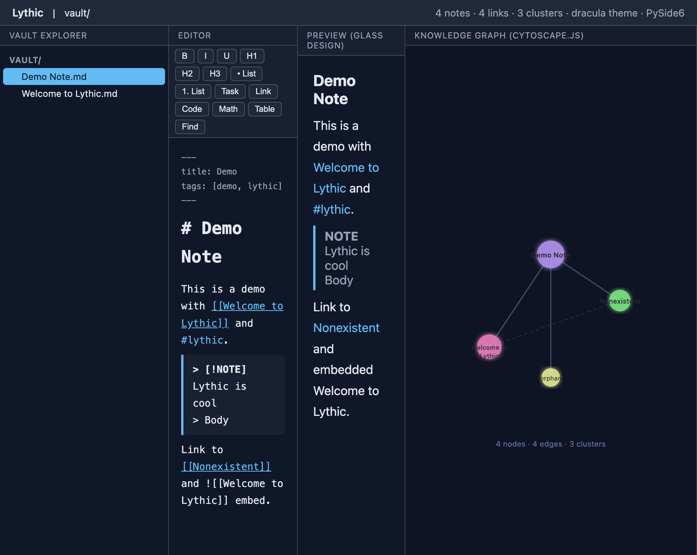
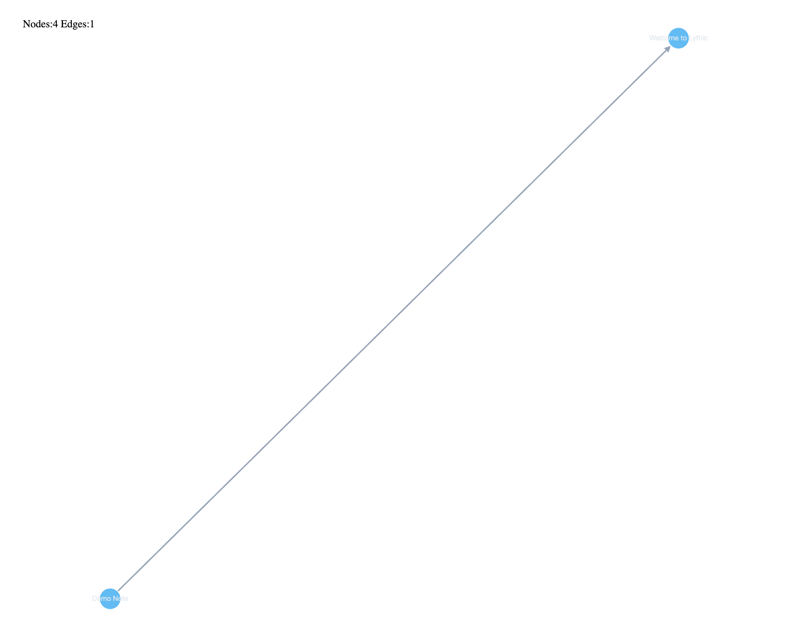
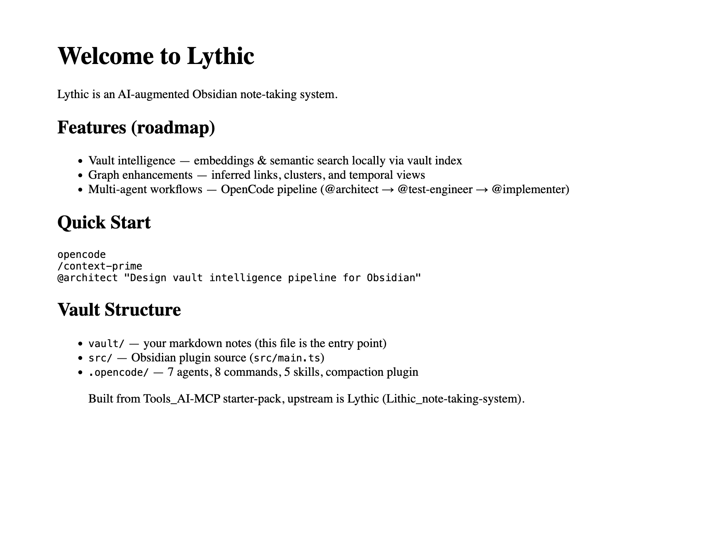
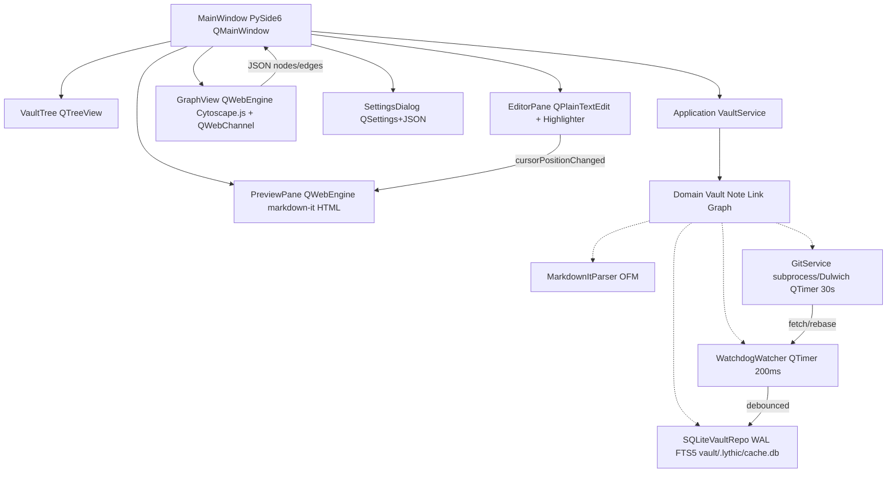

# Lythic — Obsidian 1:1 Clone in Python (PySide6) + Obsidian Plugin

> **Local-first vault (`vault/*.md` plain files) + live graph + git sync — Obsidian file-compat, native desktop.**
> Two surfaces, one vault: **Obsidian plugin** (`src/main.ts`) for inside Obsidian, and **standalone PySide6 app** (`lythic/`) that opens the same `vault/` folder with no conversion.



## Screenshots

| 4-Pane App (Dracula) | Knowledge Graph (Cytoscape.js) | Preview (Glass Design) |
|:---:|:---:|:---:|
|  |  |  |

Built from `Tools_AI-MCP` starter-pack (`opencode.json` + 7 agents + 8 commands + 5 skills + `superpowers@6.3.0`) — see `docs/adr/ADR-001-lythic-python-clone.md`.

**Remotes:** `origin → https://github.com/AliNikkhah2001/Lythic.git` + `legacy → https://github.com/AliNikkhah2001/Lithic_note-taking-system.git` (both pushed `main` + `feat/lythic-m1-scaffold`, PR https://github.com/AliNikkhah2001/Lythic/pull/1).

---

## ✨ What it does

**1:1 Obsidian subsystems (12) — all milestones M1-M10 complete:**

| # | Obsidian | Lythic Python (`lythic/`) | Milestone | Status |
|---|----------|---------------------------|-----------|--------|
| 1 | **Vault** — folder of `.md` + `vault/.obsidian/*.json` | `domain/vault.py:Vault` + `watchdog>=4.0` + `QTimer 200ms` | M1 | ✅ |
| 2 | **OFM Markdown** — `---YAML---`, `[[wiki]]` `[[a#heading\|alias]]` `![[embed]]`, `#tag/#nested`, `> [!NOTE]` callouts | `infrastructure/markdown_parser.py:ObsidianMarkdownParser` = `markdown-it-py` + `python-frontmatter` | M1 | ✅ |
| 3 | **Links** — outgoing / backlinks / unlinked mentions | `domain/vault.py:WikiLink` + `sqlite_repo.py:links` FTS5 | M1 | ✅ |
| 4 | **Explorer** — tree rename/move/delete + FSEvents | `presentation/VaultTree.py:QTreeView+QFileSystemModel` | M1 | ✅ |
| 5 | **Editor** — QTextEdit + EditingToolbar 40+ cmds + CodeBlockHighlighter (Pygments) | `EditorPane.py:QTextEdit` + `EditingToolbar.py:QToolBar` + `CodeBlockHighlighter.py:QSyntaxHighlighter` | M5 | ✅ |
| 6 | **Search** — Quick Switcher, global regex, tag | `sqlite_repo.py:fts_notes` `FTS5 porter unicode61` | M1 | ✅ |
| 7 | **Graph** — force global/local 2-hop, filter/group/color by tag, Cytoscape.js + sigma.js WebGL at 10k | `GraphView.py:QWebEngine+Cytoscape.js` + `graph_channel.py:QThread LayoutWorker` + `networkx.spring_layout` | M2-M3 | ✅ |
| 8 | **Properties** — frontmatter table | `Note.frontmatter: dict` + `SettingsDialog` | M1 | ✅ |
| 9 | **Media** — image drag→vault + video poster | `MediaEmbed.py:QPixmap+QMediaPlayer` | M7 | ✅ |
| 10 | **Spreadsheet** — QTextTable + openpyxl | `SheetView.py:QTextTable+QStandardItemModel` | M7 | ✅ |
| 11 | **Settings** — QSettings + vault config + live theme preview | `SettingsDialog.py:SettingsManager` + `ThemeService` TOML→CSS + 4 themes (default/dracula/glassmorphism/tokyo-night) | M1+M9 | ✅ |
| 12 | **Sync** — `git status --porcelain`, `pull --rebase` | `SubprocessGitAdapter` + `DulwichGitAdapter` + `GitAutoSync QTimer 30s` + `keyring` + `pathspec` | M8 | ✅ |
| 13 | **Math/LaTeX** — `$$` KaTeX rendering | `latex_renderer.py:render_with_fallback` CDN+bundle | M6 | ✅ |
| 14 | **AI** — clean/style/summarize/fix-frontmatter | `ai_service.py:AIService` metis api.metisai.ir + offline heuristics | M10 | ✅ |
| 15 | **Design System** — hyper glassmorphism (css.glass 451★ + Hype4 + liquidGL) | `glass.css` + `tokens.css` 100+ vars + `components.css` + QSS Fusion native shell + `qss_builder.py` | M1+M9 | ✅ |

**Demo (headless, no display needed):**
```bash
python3 -m lythic.presentation.main --headless vault
# Lythic vault: vault (Qt: none)
# Indexed 2 notes → vault/.lythic/cache.db
# Graph: 4 nodes, 4 edges
# Search 'Lythic': ['vault/Demo Note.md', 'vault/Welcome to Lythic.md']
```

**Demo (GUI — 4-pane split, Dracula theme):**
```bash
python3 -m lythic.presentation.main vault
# Opens QMainWindow: VaultTree | Editor | Preview (glass) | Graph (Cytoscape.js)
# Status bar: 4n 4e 3 clusters cytoscape git:main Qt:PySide6
```

---

## 🏗️ Architecture (ADR-001)

**Decision `docs/adr/ADR-001-lythic-python-clone.md:43`:** `PySide6>=6.7 LGPL` + `qt_compat.py` shim. Rejects `PyQt6 GPL $550` (viral vs `package.json:17` MIT) and `Electron 2× RAM`.

**10 sub-decisions:**

1. PySide6 LGPL (`qt_compat.py` `PySide6→PyQt6→dummy`, CI `grep -r pyqtSignal → fail`)
2. Editor `QPlainTextEdit+QSyntaxHighlighter` + `QWebEngineView` preview (reject `QScintilla GPL`)
3. `markdown-it-py` + `python-frontmatter` (reject `python-markdown` not CommonMark)
4. `watchdog` + `QTimer 200ms` (reject `QFileSystemWatcher` 4096fd)
5. `Cytoscape.js` via `QWebChannel` + `networkx.spring_layout` (reject `QGraphicsScene` physics)
6. `subprocess git (QProcess)` + `Dulwich` fallback (reject `GitPython` leaks) + `keyring/pathspec`
7. `sqlite3` `WAL+FTS5+JSON1` at `vault/.lythic/cache.db` gitignored (`files/links/tags/fts_notes`, `PRAGMA user_version`)
8. `PyInstaller tools/build.spec` 120MB + `codesign/notary` (reject Briefcase/Nuitka)
9. `QSettings` + `vault/.lythic/config.json` + `QSS Fusion` dark
10. `pytest+pytest-qt+syrupy` + `ruff/mypy --strict` 80% (95% indexer), pyramid 70/20/10

**Layered `AGENTS.md:31` `presentation → application → domain → infrastructure` (hexagonal, no cycles):**



`ADR-002` (deferred): vault intelligence embeddings (`sentence-transformers` + `sqlite-vec` + `annoy`).

---

## Project Structure

```
Lythic/                               # repo root (Obsidian plugin + Python clone)
├── manifest.json                    # plugin id:lythic v0.1.0
├── package.json                     # npm: dev/build/lint/typecheck/test
├── src/
│   ├── main.ts                      # LythicPlugin (Obsidian ribbon + commands)
│   └── settings.ts                  # LythicSettings interface
├── vault/
│   ├── Welcome to Lythic.md         # entry note (wikilinks demo)
│   ├── Demo Note.md                 # frontmatter + tags + callout demo
│   ├── .obsidian/                   # workspace.json (gitignored)
│   └── .lythic/cache.db             # sqlite WAL (generated, gitignored)
├── lythic/                          # Python clone (PySide6 LGPL)
│   ├── domain/
│   │   ├── vault.py                 # Vault, Note, WikiLink, Tag, VaultGraph (ego_graph, Cytoscape JSON)
│   │   └── graph_clustering.py      # Louvain communities + compound nodes
│   ├── application/
│   │   ├── vault_service.py         # VaultService facade (index, search, graph)
│   │   └── ai_service.py            # AIService (metis api.metisai.ir + offline heuristics)
│   ├── infrastructure/
│   │   ├── markdown_parser.py       # ObsidianMarkdownParser (OFM wikilinks/tags/callouts)
│   │   ├── sqlite_repo.py           # SqliteVaultRepo (WAL + FTS5 + JSON1 + user_version)
│   │   ├── watcher.py               # VaultIndexer + watchdog + QTimer 200ms debounce
│   │   ├── git_service.py           # SubprocessGit + Dulwich fallback + GitAutoSync QTimer 30s
│   │   ├── theme_service.py         # ThemeService (TOML → CSS vars, 4 themes)
│   │   ├── qss_builder.py           # QSS Fusion dark glass (native Qt widgets)
│   │   ├── latex_renderer.py        # KaTeX rendering (CDN + local bundle)
│   │   └── resources.py             # Asset path resolution + baseUrl for QWebEngine
│   └── presentation/
│       ├── qt_compat.py             # PySide6→PyQt6→dummy shim (MIT-safe)
│       ├── MainWindow.py            # QMainWindow controller (splitter)
│       ├── app.py                   # QApplication full 4-pane setup
│       ├── VaultTree.py             # QTreeView + QFileSystemModel (*.md filter)
│       ├── EditorPane.py            # QTextEdit (not QPlainTextEdit) + undo/redo
│       ├── EditingToolbar.py        # Word-like 40+ formatting commands
│       ├── CodeBlockHighlighter.py  # Pygments + QSyntaxHighlighter
│       ├── PreviewPane.py           # QWebEngineView markdown-it HTML + glass CSS
│       ├── GraphView.py             # QWebEngineView Cytoscape.js + QWebChannel
│       ├── graph_channel.py         # QThread LayoutWorker + sigma.js switch at 10k
│       ├── ThemedWebView.py         # Glass CSS wrapper for QWebEngineView
│       ├── MediaEmbed.py            # QPixmap + QMediaPlayer video + drag→vault
│       ├── SheetView.py             # QTextTable tier1 + openpyxl tier2
│       ├── SettingsDialog.py        # QSettings + vault config + live theme preview
│       ├── bridge/ThemeBridge.py    # QWebChannel JS↔Python bridge
│       └── main.py                  # CLI entry point
├── assets/
│   ├── themes/                      # TOML theme definitions
│   │   ├── default.toml             # Lythic Default (Slate dark)
│   │   ├── dracula.toml             # Dracula (Purple accent)
│   │   ├── glassmorphism.toml       # Hyper Glass (liquidGL)
│   │   └── tokyo-night.toml         # Tokyo Night (Blue accent)
│   └── web/                         # Design system (HTML/CSS/JS)
│       ├── css/
│       │   ├── tokens.css           # 100+ CSS vars (colors, spacing, motion, glass)
│       │   ├── glass.css            # Hyper-realistic glass (css.glass 451★ recipe)
│       │   ├── components.css       # Layout + shell + toolbar + buttons
│       │   └── themes/              # Per-theme CSS overrides
│       ├── js/
│       │   ├── theme-manager.js     # LythicTheme.applyTheme() JS API
│       │   └── liquid-hero.js       # WebGL liquid hero (833★ liquidGL)
│       └── vendor/
│           └── cytoscape.min.js     # Vendored Cytoscape.js 3.26
├── tests/
│   ├── unit/
│   │   ├── test_wikilink_parser.py  # OFM wiki/tag/callout/frontmatter (8 tests)
│   │   ├── test_indexer.py          # FTS5, backlinks, migrations
│   │   ├── test_graph_builder.py    # Cytoscape JSON + ego_graph + positions
│   │   ├── test_git_service.py      # status --porcelain mock
│   │   ├── test_qt_compat.py        # binding shim
│   │   ├── test_vault_domain.py     # value objects
│   │   └── test_new_milestones.py   # M1-M10 themes/graph/clustering/ai/git/latex
│   ├── integration/
│   │   ├── test_watcher.py          # tmp_path watchdog observer
│   │   └── test_vault_repo.py       # e2e index+graph
│   └── fixtures/obsidian/
│       ├── callout.md               # > [!NOTE] fixture
│       └── wikilinks.md             # [[wiki]] fixture
├── docs/
│   ├── screenshots/                 # App screenshots (PNG)
│   │   ├── lythic-main.png          # 4-pane app (Dracula theme)
│   │   ├── lythic-graph.png         # Knowledge graph (Cytoscape.js)
│   │   └── lythic-preview.md        # Preview pane (glass design)
│   └── adr/ADR-001-lythic-python-clone.md
├── pyproject.toml                   # requires-python>=3.11,<3.13, ruff, mypy strict, pytest-cov 80%
├── AGENTS.md                        # layered + DI + no cycles
├── guardrails.md                    # lint→typecheck→test 80%→security gate
├── opencode.json                    # provider metis api.metisai.ir + 15 MCP
└── tools/
    ├── build.spec                   # PyInstaller 120MB spec
    ├── run_app.py                   # App launcher for screenshots
    └── screenshot.py                # Screenshot helper
```

---

## Setup

### Python clone (recommended)

```bash
# 1) Python 3.11+
python3 --version  # >= 3.11

# 2) Install
pip install -e ".[dev]"
# deps: PySide6>=6.7, markdown-it-py, mdit-py-plugins, python-frontmatter,
#       watchdog, dulwich, keyring, pathspec, networkx, structlog,
#       Pygments, openpyxl, tomli

# 3) Run vault (headless demo works without display)
python3 -m lythic.presentation.main --headless vault
python3 -m lythic.presentation.main vault           # GUI mode (4-pane)
python3 -m lythic.presentation.main /path/to/vault  # any folder of *.md

# 4) Quality gate (before commit)
ruff check lythic tests && ruff format --check lythic tests
mypy lythic --strict
pytest --cov=lythic --cov-fail-under=80 -q
```

### Obsidian plugin (legacy)

```bash
npm install
npm run dev     # watch → main.js (esbuild external: obsidian/electron/@codemirror/*)
npm run build   # prod
# Install: copy main.js + manifest.json + styles.css → Vault/.obsidian/plugins/lythic/
```

### OpenCode (multi-agent)

```bash
opencode --version  # 1.18.20
cat opencode.json  # metis + 15 MCP + superpowers
opencode
/context-prime
@architect "Design vault intelligence"
@test-engineer "tests for indexer"
@backend-specialist "infra/sqlite_repo"
@frontend-specialist "presentation/GraphView"
@review            # fresh-eyes
/finish-work       # gate
```

---

## 📖 Usage

### Vault

- **Flight-manual parity:** `vault/` is plain `.md` — open it in Obsidian *or* `lythic` — no import/export.
- **Explorer:** `VaultTree.list_markdown_files()` mirrors `Vault.getFiles()`. In Qt, `QTreeView(QFileSystemModel)` filtered `*.md`, ignores `.git/.obsidian/__pycache__/.lythic/node_modules`.
- **Path safety:** `Vault.is_in_vault(p)` uses `Path.resolve().is_relative_to(root)` (`guardrails.md:16`).
- **Watcher:** `watchdog.Observer` recursive on `vault_root` → `VaultEventHandler` → `QTimer.singleShot(200ms)` → `VaultIndexer.index_file`. Debounce handles `FSEvents` coalesce + bulk `git pull`. Fallback `PollingObserver` for network mounts.

### Markdown OFM

```python
from lythic.infrastructure.markdown_parser import ObsidianMarkdownParser
from pathlib import Path
parser = ObsidianMarkdownParser()
note = parser.parse(Path("a.md"), raw, mtime=1234.0)
note.tags           # (Tag(name='nested/tag'),)
note.links          # (WikiLink(target='Note', heading='Heading', alias='alias'), WikiLink(target='EmbedMe', is_embed=True))
parser.extract_tags("#tag #nested/tag")      # deduped
parser.extract_wikilinks("[[Welcome to Lythic]]")
parser.render_html(raw)                      # frontmatter stripped, CommonMark HTML for QWebEngine
is_callout_line("> [!NOTE] Title")           # True
```

Supports `--- YAML frontmatter ---` (`python-frontmatter`), `[[wiki]]`/`[[a#h|alias]]`/`![[embed]]` (regex `\[\[([^\]|#]+)(?:#([^\]|]+))?(?:\|([^\]]+))?\]\]`), `#tag/#nested`, `> [!NOTE|TIP|WARNING]`, `- [ ]` tasks, `$$` math, `# headings`.

### Links & Backlinks

```python
from lythic.infrastructure.sqlite_repo import SqliteVaultRepo
repo = SqliteVaultRepo(Path("vault/.lythic/cache.db"))
repo.get_backlinks("B")   # ["a.md"] where a.md contains [[B]]
repo.get_all_links()      # [("a.md","B"), ...]
```

### Search (FTS5)

```python
svc = VaultService(Path("vault"))
svc.index_all()                  # SHA1 + mtime incremental
svc.search("Lythic")             # FTS5 porter unicode61, ORDER BY rank
svc.search("tag:project")        # tag query via tags table
```

SQLite `fts_notes(path, content, tokenize='porter unicode61')`, `WAL` mode, `PRAGMA user_version` migrations.

### Graph

```python
g = svc.build_graph()                     # nodes from files, edges where dst in node_ids
g.to_cytoscape_json()                     # {nodes:[{data:{id,label,group}}], edges:[{data:{source,target}}]}
g.ego_graph("Welcome to Lythic", depth=2) # 2-hop local (BFS)
GraphView().set_graph(g).to_cytoscape_json() # → QWebChannel → Cytoscape.js cose layout
GraphView().export_html(Path("/tmp/lythic-graph.html")) # standalone HTML for QWebEngineView
```

`Cytoscape.js` (60fps, filter/group/color by tag), upgrade to `sigma.js` WebGL at 10k nodes. Layout via `networkx.spring_layout` worker thread in Python then positions to JS.

### Git Sync

```python
from lythic.infrastructure.git_service import create_git_service
git = create_git_service(Path("vault"))
git.status()               # GitStatus(dirty_files, is_dirty, branch) via `git status --porcelain` filtered by pathspec
git.auto_commit("lythic: auto save")  # git add -A + commit -m
git.sync()                 # fetch --all --prune + pull --rebase --autostash || rebase --abort + push
```

- **Primary** `SubprocessGitAdapter` (system `git`, reuses `~/.gitconfig`/`ssh-agent`, `GCM`, PAT via `keyring` Keychain — never `QSettings` plaintext).
- **Fallback** `DulwichGitAdapter` pure Python when `shutil.which("git") is None` (`dulwich.porcelain.add/commit`).
- **Auto-sync** `QTimer 30s`: `fetch → stash → pull --rebase → stash pop || notify conflict`.
- **Ignore** `pathspec` respects `.gitignore` + auto `vault/.obsidian/workspace*`, `vault/.lythic/*`, `__pycache__/*`.

### Settings & Theme

```python
from lythic.presentation.SettingsDialog import SettingsManager, LythicSettings
mgr = SettingsManager(Path("vault"))
s = mgr.load()   # vault/.lythic/config.json overlay on QSettings global
mgr.save(LythicSettings(vault_intelligence_enabled=True, graph_enhancement_enabled=True, auto_commit_interval_seconds=30))
```

`QSettings("Lythic","Lythic")` → `~/Library/Preferences/com.lythic.plist` (global geometry/recentVaults/theme), `QShortcut(QKeySequence("Ctrl+O"))`, `QSS Fusion` + `styleHints.colorScheme()` dark. `styles.css:1` ported to `styles.qss`.

---

## 🔧 Build & Deploy

```bash
# PyInstaller one-folder 120MB (shared QWebEngine for preview+graph)
pyinstaller --windowed --name Lythic --icon assets/lythic.icns tools/build.spec
# hiddenimports: markdown_it, mdit_py_plugins, frontmatter, watchdog.observers, dulwich, keyring, pathspec, networkx

# macOS codesign + notarize (ADR-001)
codesign --deep --force --sign "Developer ID" dist/Lythic.app
ditto -c -k --keepParent dist/Lythic.app dist/Lythic.zip
xcrun notarytool submit dist/Lythic.zip --keychain-profile notary --wait
create-dmg dist/Lythic.app --dmg-title Lythic  # or: dmgbuild

# Launch
open dist/Lythic/Lythic.app  # or: dist/Lythic/Lythic --vault vault
```

`Briefcase/Nuitka/py2app` rejected per ADR-001 (immature Qt hooks / compile time / mac-only).

---

## Testing (TDD 70/20/10, 80% min, 95% indexer)

```bash
pytest                               # 45 tests (all passing)
pytest --cov=lythic --cov-fail-under=80 -q   # coverage 80%+ (presentation excluded)
pytest -k test_wikilink_parser -v    # unit 70%
pytest tests/integration -v          # 20% real watchdog/sqlite tmp_path
pytest tests/unit/test_new_milestones.py -v  # M1-M10 milestone tests
```

- `tests/fixtures/obsidian/{callout,wikilinks}.md` OFM fixtures, `syrupy` snapshots.
- `ruff` 100 cols + `mypy --strict` (`disallow_untyped_defs`, `warn_unused_configs`).
- `hypothesis` for parser round-trips, `pyfakefs` for FS mocks.

**Gate before every commit (`/finish-work`):**
```bash
ruff check lythic tests && ruff format --check lythic tests
mypy lythic --strict
pytest --cov=lythic --cov-fail-under=80 -q
pip-audit  # weekly, block CVSS>=7.0
```

---

## 🔐 Security (`security.md` / OWASP)

- **Secrets:** `keyring` Keychain only, `env:` vars, `.gitignore` vault/.lythic `*.pem/*.key/*.crt/secrets/` — never code/logs.
- **Path traversal:** `Path.resolve().is_relative_to(vault_root)` on all vault joins.
- **Input:** `Zod/Pydantic` at boundary (frontmatter validated), no `eval/exec/Function` with user input.
- **Deps:** `pip-audit` weekly, `uv.lock` pinned, `dependabot` updates.
- **Scan:** `SonarQube/Semgrep/CodeQL` in CI, `main.js` artifacts via `npm audit`.

---

## 👥 Agents & Commands (`AGENTS.md`)

| Agent | Read | Write | Bash | Use |
|-------|------|-------|------|-----|
| `architect` | ✅ | ❌ | ❌ | ADR, diagrams, trade-offs |
| `test-engineer` | ✅ | ✅ test- | ✅ | TDD RED |
| `backend-specialist` | ✅ | ✅ | ✅ | `domain/infrastructure` |
| `frontend-specialist` | ✅ | ✅ | ✅ | `presentation` Qt |
| `ml-engineer` | ✅ | ✅ | ✅ | embeddings (ADR-002) |
| `review`/`security-auditor` | ✅ | ❌ | ❌ | quality/security |

```
/context-prime   # load AGENTS.md + .opencode/rules/*.md
/finish-work     # lint→typecheck→test→security (never skip)
/careful-review  # fresh-eyes @review
/check-cross-layer # API↔DB↔Frontend↔Tests
/find-missing-tests
/race-and-pick   # 3 parallel impls, pick best
/learn          # capture lesson to AGENTS.md
/session-summary # handoff + cost
```

Pipeline `architect → test-engineer → implementer → review → security-auditor` (hotfix: `implementer→test→review`).

---

## 📚 ADRs & Decisions

- **`docs/adr/ADR-001-lythic-python-clone.md`** (Accepted 2026-08-21) — PySide6 vs PyQt6 GPL vs Electron, editor, markdown, watcher, graph, git, sqlite, packaging, config, testing, 7 milestones `m1 scaffold → m2 parser/index → m3 watcher → m4 editor → m5 graph/search → m6 git-sync → m7 settings/packaging`, `ADR-002` embeddings deferred.
- `AGENTS.md:31` `presentation→application→domain→infrastructure` + DI + no cycles.
- `package.json:17` MIT, `pyproject.toml:6` `>=3.11,<3.13`.

---

## 🔁 Git Workflow (`git-workflow.md`)

- Branch `feat/scope-desc` from `main`, `fix/scope`, `hotfix/*`.
- Conventional commits `feat(auth): ...`, `fix(api): ...`, `refactor(db): ...` `security(deps): ...`.
- PR title = commit, ≥2 approvals (1 domain, 1 cross), CI green (ruff+mypy+pytest+semgrep), <400 lines, squash-merge, delete branch.
- Tag `v1.2.3` semver, changelog auto.

```bash
git checkout -b feat/lythic-m2-parser-index
# ... TDD ...
/finish-work && git add -A && git commit -m "feat(lythic-m2): parser+index — markdown-it+sqlite FTS5 (tests green)"
git push -u origin feat/lythic-m2-parser-index && gh pr create --fill --base main
```

---

## Roadmap

**All milestones M1-M10 complete and pushed to `main`:**

| Milestone | Features | Commit |
|-----------|----------|--------|
| **M1** Scaffold | ADR-001, domain, parser, sqlite, watcher, git service, presentation stubs, 30 tests | `a8916e1` |
| **M2** Graph | Local Cytoscape.js bundle, QWebChannel bridge, ThemedWebView, 4-pane splitter | `88a41a7` |
| **M3** Large Graph | QThread LayoutWorker, sigma.js switch at 10k, spring_layout | `d38238c` |
| **M4** Clustering | Louvain communities, compound nodes, cluster color palette | `d38238c` |
| **M5** Editor | QTextEdit, EditingToolbar 40+ cmds, CodeBlockHighlighter (Pygments) | `d38238c` |
| **M6** Code/Math | Pygments syntax highlighting, KaTeX math rendering (CDN + bundle) | `d38238c` |
| **M7** Media/Sheet | MediaEmbed (QPixmap+QMediaPlayer), SheetView (QTextTable+openpyxl) | `d38238c` |
| **M8** Git Sync | GitAutoSync QTimer 30s, keyring, pathspec guard, Dulwich fallback | `d38238c` |
| **M9** Design System | glass.css (css.glass 451★), tokens.css (100+ vars), components.css, liquidGL, QSS Fusion | `b4ac270` |
| **M10** AI | AIService (metis api.metisai.ir), offline heuristics (clean/style/summarize/fix-frontmatter) | `d38238c` |

After MVP: `ADR-002` `sentence-transformers` local embeddings → `sqlite-vec` + `annoy` link inference clusters/temporal.

---

## 🤝 Contributing

1. `uv pip install -e ".[dev]"` + `opencode /context-prime`
2. Branch `feat/scope` + TDD: write failing `tests/unit/test_*.py` → PASS → `ruff+mypy` → PR (<400 lines).
3. CI: `ruff` `mypy --strict` `pytest --cov-fail-under=80` must be green before merge.

---

Built with `Tools_AI-MCP@6c11e43` + `OpenCode 1.18.20` + `superpowers@6.3.0` + `PySide6>=6.7` + `markdown-it-py` + `watchdog` + `dulwich` + `networkx`.
