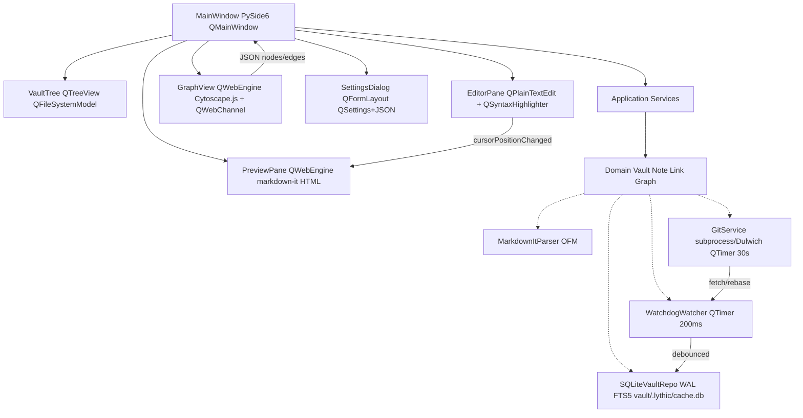

# ADR-001: Lythic Python Clone — PySide6 + Vault + Graph + Git Sync

## Status: Accepted (2026-08-21)
Authors: @architect  Deciders: Ali Nikkhah
Supersedes: Obsidian plugin `src/main.ts:15` LythicPlugin stub (kept as legacy shim)
Related: `src/settings.ts:1`, `esbuild.config.mjs:10`, `manifest.json:2`, `vault/Welcome to Lythic.md:1`, `AGENTS.md:31`, `guardrails.md:1`

## Context
- Problem: `LythicPlugin` (`src/main.ts:15`) is Obsidian-hosted (requires Obsidian, `esbuild.config.mjs:17` externals `obsidian/electron/@codemirror/*/@lezer/*`), only 2 stub commands `lythic-open-graph:24` / `lythic-index-vault:30`, ribbon `brain:20`, no standalone distribution. Vault is `vault/*.md` (+ `vault/.obsidian/*.json` empty now) with single `Welcome to Lythic.md`. Build `npm run dev/build` → `main.js` via `esbuild`.
- Requirements: Functional — open arbitrary vault folder (keep Obsidian file-compat plain `*.md`), explorer tree rename/move/delete, editor with wiki-links `[[wiki]] [[a#heading|alias]] ![[embed]]`, tags `#tag/#nested`, callouts `> [!NOTE]`, tasks `- [ ]`, math `$$`, preview sync, backlinks/outgoing/unlinked, search Quick Switcher `Cmd+O` + global regex + tag search, graph global/local 2-hop filter/group/color by tag/folder, command palette + hotkeys, settings, git auto-sync. Non-functional — 10k notes <2s incremental, launch <1.5s, binary <150MB, MIT-compatible, strict typing (`mypy --strict`, `ruff` 100 cols), 80% coverage (95% indexer), no secrets in code (`security.md`), `path.resolve()` traversal protection, macOS primary (FSEvents), Linux/Win secondary.
- Constraints: MIT (`package.json:17`), layered `presentation → application → domain → infrastructure` (`AGENTS.md:31`), dependency inversion domain defines ports infra implements, no circular deps, secrets via `env:`/`keyring`, conventional commits, squash-merge, `requires-python >=3.11,<3.13` (dev 3.12 via `uv`), `guardrails.md:5` gate lint→typecheck→test→security.

## Obsidian Audit — 12 Subsystems (OFM spec + src/main.ts:11 esbuild:10)
1. Vault — `vault/*.md` + attachments + `vault/.obsidian/*.json`, `Vault.getFiles()/metadataCache` + FSEvents/inotify
2. OFM Markdown — `---YAML---`, `[[wiki]] [[a#heading|alias]] ![[embed]]`, `#tag/#nested`, `> [!NOTE]`, `- [ ]`, `$$` → `markdown-it-py` + `mdit-py-plugins` + `python-frontmatter` + `ObsidianWikiLinkPlugin` + CodeMirror6/Lezer ref
3. Links — outgoing/backlinks/unlinked → `metadataCache.getFileCache().links`
4. Explorer — tree + FSEvents → `VaultTree (QTreeView)` + `QFileSystemWatcher` fallback
5. Editor — Live Preview vs Source, folding, vim → `QPlainTextEdit+QSyntaxHighlighter` + `QWebEngineView` preview + `MarkdownView/Editor` port
6. Search — Quick Switcher `Cmd+O`, global regex, tag → `sqlite FTS5` + `fts_notes`
7. Graph — force global/local 2-hop, filter/group/color → `QWebEngineView+Cytoscape.js/vis-network` + `networkx.spring_layout` worker + `QWebChannel` (sigma.js at 10k)
8. Properties — frontmatter table
9. Command palette — `addCommand()+hotkeys` → `QShortcut` + `QSettings`
10. Settings — `loadData/saveData→data.json` → `QSettings` global + `vault/.lythic/config.json`
11. Plugin API — `Plugin:onload:17/onunload:41` → keep as shim
12. Sync — Obsidian Sync / `obsidian-git` (`git status --porcelain`, `pull --rebase`) → `subprocess git` via `QProcess` + `Dulwich>=0.22` fallback + `keyring` + `pathspec`

## Options Considered
### Option 1: Stay Obsidian Plugin Only (status quo)
- Pros: zero stack, reuse `LythicPlugin`/`LythicSettings:1`, instant Obsidian users.
- Cons: gated by Obsidian release, no standalone, cannot control watcher/graph perf, Electron-only web stack.
- Effort: S.

### Option 2: Electron + Python Sidecar (reuse src/main.ts)
- Pros: reuse CodeMirror, web hiring pool.
- Cons: 180-300 MB, 2 runtimes, Python ML IPC, violates Python direction, 2-3× memory.
- Effort: L (6w).

### Option 3: Python PySide6 (LGPL) Native — QPlainTextEdit + MarkdownIt + Watchdog + SQLite FTS5 + QWebEngine/Cytoscape + subprocess git + PyInstaller [RECOMMENDED]
- Pros: MIT-safe (LGPL dynamic link, `PySide6>=6.7`), native Qt perf, single language, stdlib `sqlite3` FTS5, `watchdog` handles 100k files recursive, Cytoscape parity with Obsidian graph, subprocess git reuses user `~/.gitconfig`/`ssh-agent`, 120 MB binary, hexagonal ports enable future embeddings (ADR-002).
- Cons: `QWebEngineView` +80 MB (shared preview/graph), custom highlighter needed, notarization pipeline (`codesign`/`notarytool`), `QScintilla` unavailable on PySide6.
- Effort: M (12-16w split 7 milestones).

## Decision
**Chosen: Option 3 (PySide6).** Rationale: Only MIT-compatible Qt binding (PyQt6 GPL $550 viral, incompatible with `package.json:17` MIT), aligns with `.opencode/rules/coding-style.md` Python strict (`ruff` 100, `mypy --strict`, `Path`, `structlog`), `AGENTS.md:31` hexagonal, `guardrails.md` quality gate, keeps `vault/` file-compat plain `*.md`, enables `domain/VaultRepository`/`GitService` ports.

### Sub-decisions (10)
1. **PySide6 6.7+ + `qt_compat.py` shim** — `try: PySide6 except: PyQt6` + `Signal/Slot` alias, CI `grep -r pyqtSignal → fail`. Reject PyQt6 GPL, Electron.
2. **Editor `QPlainTextEdit+QSyntaxHighlighter` + `QWebEngineView` preview sync** — cursor `QTextCursor` → `markdown-it-py` HTML via `QWebChannel`. Reject `QScintilla` GPL, pure CodeMirror WebEngine (would double WebEngine cost).
3. **`markdown-it-py>=3.0` + `mdit-py-plugins>=0.4` + `python-frontmatter>=1.0` + `ObsidianWikiLinkPlugin`** regex `\[\[([^\]|#]+)(?:#([^\]|]+))?(?:\|([^\]]+))?\]\]` + `CalloutPlugin` (`> [!NOTE]`). Reject `python-markdown` (not CommonMark). Tokens cached by `mtime+hash`.
4. **`watchdog>=4.0` + `QTimer 200ms` debounce** — single recursive `Observer`, `PatternMatchingEventHandler` ignoring `.git/.obsidian/__pycache__`. Reject `QFileSystemWatcher` alone (4096 fd limit, misses bulk `git pull`).
5. **`QWebEngineView+Cytoscape.js`/`vis-network` + `networkx.spring_layout` worker + `QWebChannel`** — Python `networkx` metadata + initial pos → JSON `{nodes:[{id,label,group,mtime}], edges:[{source,target}]}` → JS physics (zoom/pan/lasso). Upgrade to `sigma.js` WebGL at 10k, default 2-hop local filter. Reject `QGraphicsScene` custom physics (L 5w).
6. **`subprocess git` via `QProcess` + `Dulwich>=0.22` fallback + `keyring` + `pathspec`** — `GitService` port → `SubprocessGitAdapter` (uses system auth) else `DulwichGitAdapter` if `shutil.which("git")` missing. `QTimer 30s`: `fetch → stash → pull --rebase → stash pop || notify conflict`. `pathspec` respects `.gitignore` (+ auto-append `vault/.obsidian/workspace*`). Reject `GitPython` (handle leaks, requires git, slow `status`).
7. **`sqlite3` stdlib `WAL+FTS5+JSON1` at `vault/.lythic/cache.db`** — gitignored (`vault/.lythic/` in `.gitignore`), tables `files(path PK, mtime REAL, hash TEXT, frontmatter JSON, word_count INT)`, `links(src,dst,pos)`, `tags(path,tag)`, `fts_notes` (`porter unicode61`), `backlinks_view`, `PRAGMA user_version` migrations. Reject DuckDB (overkill), JSON whole-rewrite, Whoosh (unmaintained).
8. **PyInstaller `tools/build.spec` + codesign** — `pyinstaller --windowed --name Lythic --icon assets/lythic.icns`, `hiddenimports=['markdown_it','mdit_py_plugins','frontmatter','watchdog.observers']`, `collect_data_files`, 90-150 MB one-folder, `codesign --deep` + `xcrun notarytool` + `create-dmg`. Reject Briefcase/Nuitka/py2app.
9. **`QSettings` global (`Lythic/Lythic` → `~/Library/Preferences/com.lythic.plist`) + `vault/.lythic/config.json` vault (overlay), `QShortcut(QKeySequence)`, `QSS Fusion` + `styleHints.colorScheme()` dark** — port `src/settings.ts:1` `vaultIntelligenceEnabled/graphEnhancementEnabled` + `LythicSettingTab:80` as `QDialog(QFormLayout)`. Reject TOML-only.
10. **`pytest>=8` + `pytest-qt>=4` + `syrupy` snapshots + `ruff` + `mypy --strict` + `pytest-cov` 80% (95% indexer)** — `tests/unit/` mocked `pyfakefs`/`tmp_path`, `tests/integration/` real `watchdog`/`sqlite`, `tests/fixtures/obsidian/*.md` OFM, `hypothesis` for parser. Pyramid 70/20/10 (`testing.md`). Reject no-op.

Python: `requires-python=">=3.11,<3.13"` (min 3.11 for `tomllib` stdlib, dev 3.12 for PEP 695, avoid 3.13 PyInstaller lag), `uv python pin 3.12`, lock `uv.lock`. Platforms: macOS 12+ ARM64+x86_64 primary, Linux/Win secondary.

## Consequences
- Positive: MIT distribution, local-first, fast incremental index (`hashlib.sha1` + `mtime` check), graph parity, git sync with `keyring` Keychain, testable hexagonal domain, future ADR-002 embeddings (`sqlite-vec` + `sentence-transformers` + `annoy`) pluggable.
- Negative: WebEngine bloat (+80 MB, mitigated sharing preview/graph), highlighter maintenance, PySide6 `QScintilla` gap, macOS notarization overhead.
- Risks: FSEvents coalesce → 200 ms debounce + `PollingObserver` fallback; `git` missing → Dulwich fallback; 10k graph jank → 2-hop filter + sigma.js; GPL slip → CI `rg pyqtSignal` fail; path traversal → `Path.resolve().is_relative_to(vault_root)` check.

## Implementation Plan (7 milestones, each `feat/lythic-m{i}-{name}` branch, TDD RED→GREEN)
1. **m1-scaffold** — `pyproject.toml` (3.12, PySide6, ruff, mypy strict, pytest-qt) + `lythic/` package `domain/application/infrastructure/presentation` + `tests/fixtures` + `qt_compat.py` + `ConfigService` + CI
2. **m2-parser-index** — `domain/vault.py` + `domain/note/link/graph/tag.py` + `infrastructure/markdown_parser.py` (OFM plugin) + `infrastructure/sqlite_repo.py` (migrations `user_version`) — snapshots 95%
3. **m3-watcher** — `infrastructure/watcher.py` (watchdog→QTimer) + incremental `index_incremental(path)` + `VaultIndexer` service
4. **m4-editor** — `presentation/MainWindow.py` (`QMainWindow` splitter) + `VaultTree(QTreeView+QFileSystemModel)` + `EditorPane(QPlainTextEdit+Highlighter)` + `PreviewPane(QWebEngine)` synced
5. **m5-graph-search** — `application/SearchService(FTS5)` + `presentation/GraphView(QWebEngine+Cytoscape+QWebChannel)` + `domain/graph.py` (`networkx` builder, 2-hop `ego_graph`) + Quick Switcher `Cmd+O`
6. **m6-git-sync** — `domain/GitService` port → `infra/git_service.py` (`SubprocessGitAdapter`/`DulwichGitAdapter`, `QProcess`, `QTimer 30s`, `keyring`, `pathspec`) + conflict notify
7. **m7-settings-packaging** — `presentation/SettingsDialog(QFormLayout)` + `QSS` theme + `tools/build.spec` PyInstaller + `codesign` pipeline + `/finish-work` green

```
presentation/ (Qt PySide6): MainWindow, VaultTree, EditorPane, PreviewPane(QWebEngine), GraphView(QWebEngine), SettingsDialog
application/: OpenVaultUseCase, IndexVaultService, GitSyncService(QTimer), SearchService
domain/: Vault, Note, Link, Tag, Graph (networkx), VaultRepository Port, GitService Port, MarkdownParser Port
infrastructure/: SQLiteVaultRepo, MarkdownItParser, WatchdogWatcher, SubprocessGitAdapter/DulwichGitAdapter, QSettingsConfig
```

## Diagram


## Alternatives Rejected
PyQt6 GPL (relicense/pay $550×N), QScintilla GPL, python-markdown (not CommonMark), QFileSystemWatcher only (fd limit), QGraphicsScene physics (5w), GitPython (leaks), DuckDB (overkill), Briefcase/Nuitka (immature hooks), py2app (mac-only).

## Compliance
- License LGPL dynamic link check, `pip-audit` weekly, `.gitignore` add `vault/.lythic/` + `__pycache__` + `dist/*.egg-info`, secrets via `keyring` only, `path.resolve()` for vault joins, `npm audit` kept for `src/main.ts` plugin, `ruff` 100 cols + `mypy --strict` + `pytest --cov-fail-under=80`.

## ADR-002 Deferred
Vault intelligence embeddings — `sentence-transformers` local, `sqlite-vec` vector table, `annoy`/`usearch`, link inference clusters/temporal. After MVP m7.

---
*Verified: AGENTS.md:31 layered, package.json:17 MIT, src/main.ts:15/24/30/80, esbuild.config.mjs:17 externals, opencode.json:3 metis, guardrails.md:5 gate.*
