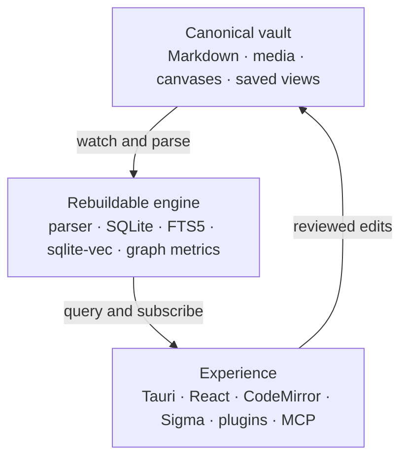

# Project Lattice

## An open-source knowledge engine beyond Obsidian

Project Lattice is a practical plan for a local-first, Markdown-compatible knowledge application with a more useful graph, safer automation, and optional citation-first AI.

**Research snapshot:** 24 August 2026

> The central promise: notes and attachments remain normal files owned by the user. Search indexes, embeddings, graph metrics, and layouts may accelerate the experience, but they cannot become the only copy of the user’s knowledge.

## The recommendation

Start with [Atomic](https://github.com/kenforthewin/atomic), then introduce a strict filesystem vault boundary before expanding the interface.

Atomic is currently the closest permissively licensed source base to the intended product. Its repository documents:

- an MIT license;
- Rust business logic and server;
- a Tauri v2 desktop app;
- a React/TypeScript and CodeMirror interface;
- SQLite with `sqlite-vec`;
- a Sigma.js/Graphology graph canvas;
- optional model providers, semantic search, an MCP endpoint, and a browser clipper.

This reduces the amount of infrastructure that must be invented. However, the new project should treat Markdown files—not database records—as canonical.

### Borrow from SilverBullet

[SilverBullet](https://github.com/silverbulletmd/silverbullet) is the strongest permissive reference for a programmable Markdown knowledge environment. Its built-in query language, templates, commands, widgets, and Lua scripting show how the app can grow with the user without making every workflow part of the core.

### Learn from AGPL projects without ignoring the license

[Logseq](https://github.com/logseq/logseq) and [TriliumNext](https://github.com/TriliumNext/Trilium) are mature and technically valuable. Both repositories use AGPL-3.0. If the new project wants a permissive MIT or Apache-2.0 core, their behavior and documentation can inform an independent implementation, but their code should not be copied casually.

## Compared starting points

| Project | License | Strongest signal | Recommended role |
|---|---|---|---|
| [Atomic](https://github.com/kenforthewin/atomic) | MIT | AI, graph, Rust/Tauri, local SQLite, MCP | Primary fork candidate |
| [SilverBullet](https://github.com/silverbulletmd/silverbullet) | MIT | Programmable Markdown and queries | Extension-model reference |
| [Nodum](https://github.com/nodummd/nodum) | MIT | Web-first vaults, collaboration and publishing | Alternative for a browser-first product |
| [Foam](https://github.com/foambubble/foam) | MIT | Obsidian-compatible Markdown in VS Code | Narrow MVP and link-resolution reference |
| [Logseq](https://github.com/logseq/logseq) | AGPL-3.0 | Block graph and Datalog querying | Study; choose AGPL before incorporating code |
| [TriliumNext](https://github.com/TriliumNext/Trilium) | AGPL-3.0 | Scale, hierarchy, scripting, sync and maps | Study; choose AGPL before incorporating code |
| [AFFiNE](https://github.com/toeverything/AFFiNE) | MIT Community Edition | CRDT collaboration and block/canvas architecture | Heavyweight collaboration reference |

## Product constitution

1. **Markdown and attachments are canonical.**
2. **Deleting the index cannot delete knowledge.**
3. **The daily-driver workflow works offline.**
4. **AI features are optional and provider-pluggable.**
5. **Suggested edits are reviewable patches.**
6. **Generated answers cite notes, blocks, and sources.**
7. **Plugins request explicit capabilities.**
8. **Saved views are portable files.**
9. **Obsidian vault import is tested continuously.**
10. **No feature requires lock-in to a hosted sync service.**

## Reference architecture



### Canonical vault

```text
MyVault/
├── notes/
├── attachments/
├── canvases/
└── .lattice/
    ├── views/
    ├── events/
    ├── plugins/
    └── config.toml
```

The format should document CommonMark extensions, YAML frontmatter fields, wikilink resolution, aliases, heading references, block IDs, attachment rules, and JSON Canvas compatibility. Opening an existing Obsidian vault should not trigger a destructive mass rewrite.

### Rebuildable engine

Use a Rust core to:

- reconcile filesystem changes;
- parse documents, headings, blocks, properties, tags, tasks, citations, and links;
- maintain FTS5 lexical search;
- maintain optional `sqlite-vec` embeddings;
- store typed edges and edge provenance;
- compute graph health and communities in background jobs;
- expose local HTTP/WebSocket and MCP APIs;
- rebuild the index deterministically from files.

### Experience layer

- Tauri v2 for the desktop shell.
- React/TypeScript for the interface.
- CodeMirror 6 for source-aware editing.
- Sigma.js for WebGL rendering and Graphology for graph structures/algorithms.
- A capability-based plugin host using sandboxed JavaScript, WebAssembly, or isolated processes.
- Yjs only when optional collaboration is added; single-user file correctness comes first.

## Differentiating functionality

### Graph lenses

Treat edges as typed and explainable. A view can combine:

- explicit wikilinks;
- semantic similarity;
- shared tags/properties;
- citations and common sources;
- task dependencies;
- temporal relationships;
- plugin-defined edges.

Clicking an edge should explain its type, origin, score, and supporting blocks.

### Temporal graph

Record meaningful vault events so users can replay growth, compare dates, and inspect when a cluster or important bridge appeared. History becomes queryable structure rather than only a backup mechanism.

### Atomicity coach

Suggest—not silently perform—splits, merges, extracted claims, missing links, duplicate consolidation, and bridge notes. Present every operation as a diff with source citations.

### Provenance-first AI

Answers should report:

- note and block IDs;
- relevant source URLs;
- retrieval scores;
- model/provider and version;
- generated-versus-authored status;
- the patch or output that will be written.

### Knowledge-health dashboard

Surface orphans, broken links, ambiguous links, stale hubs, duplicate clusters, unsupported syntax, uncited claims, unresolved questions, and high-value bridge notes.

### Portable saved views

Store graph filters, layouts, style rules, annotations, and query expressions in `.lattice/views`. Users can version these files with Git or share them without exporting from the app.

## Core model

| Entity | Canonical identity | Important fields |
|---|---|---|
| Document | stable UUID plus path mapping | path, title, aliases, type, timestamps, content hash |
| Block | document ID plus explicit/derived block key | range, heading, text hash, source metadata |
| Edge | source, target, edge type, provenance | explicit/derived, score, parser/model version |
| Event | event UUID and timestamp | actor, operation, affected IDs, before/after hash |
| View | view UUID | query, filters, layout, style, annotations |
| Embedding | content hash and model ID | vector, dimensions, chunk, created time |

## Plugin capability sketch

```toml
id = "example.graph-lens"
version = "0.1.0"

[permissions]
vault_read = true
vault_write = false
network = ["api.example.org"]
models = false
ui_slots = ["graph.toolbar"]
```

Permission changes should be visible and separately approved. Plugin failures must not corrupt the vault or block the core editor.

## Roadmap

### Phase 0 — constitution (1–2 weeks)

- Select MIT or Apache-2.0.
- Publish the vault-format specification.
- Define privacy, plugin, and AI safety rules.
- Create compatibility fixtures for difficult vaults.

### Phase 1 — vault kernel (3–5 weeks)

- Filesystem watcher and reconciliation.
- Markdown/wikilink/property parser.
- SQLite schema, FTS5 search, migrations, and rebuild command.
- Non-destructive Obsidian import report.

### Phase 2 — daily driver (4–6 weeks)

- Tauri packaging and CodeMirror editor.
- Tabs, backlinks, outline, quick switcher, commands, undo, and safe rename.
- External-edit conflict handling.
- Markdown/attachment export.

### Phase 3 — graph engine (4–6 weeks)

- Sigma/Graphology large-graph rendering.
- Global/local views, typed edges, graph lenses, communities, and edge inspector.
- Saved views, graph health, event foundation, and performance fixtures.

**First credible release:** phases 0–3.

### Phase 4 — intelligence (6–10 weeks)

- Local embeddings and provider adapters.
- Cited semantic search and question answering.
- Atomicity coach, duplicate detection, and reviewable edits.
- Model/version provenance and data redaction.

### Phase 5 — ecosystem (8–12 weeks)

- Plugin SDK and reference plugins.
- Scoped MCP endpoint.
- Web clipper and publishing.
- Optional encrypted sync and collaboration.

## Risks and mitigations

| Risk | Mitigation |
|---|---|
| Obsidian compatibility expands without limit | Publish a supported-syntax matrix and fixtures; do not promise every plugin format |
| Derived state becomes accidental lock-in | Make full index deletion/rebuild a release test |
| AI damages authored knowledge | Read-only by default; writes require diffs and explicit acceptance |
| Graph becomes slow or decorative | Typed-edge budgets, WebGL renderer, graph questions, and performance fixtures |
| Plugins compromise vaults | Capabilities, sandboxing, signatures, audit logs, and revocation |
| Sync corrupts files | Add sync late; property-based conflict tests and recoverable version history |
| License contamination | Dependency bill of materials and contribution provenance checks |

## Useful repositories and documentation

### Applications

- [Atomic](https://github.com/kenforthewin/atomic)
- [SilverBullet](https://github.com/silverbulletmd/silverbullet)
- [Nodum](https://github.com/nodummd/nodum)
- [Logseq](https://github.com/logseq/logseq)
- [TriliumNext](https://github.com/TriliumNext/Trilium)
- [Foam](https://github.com/foambubble/foam)
- [AFFiNE](https://github.com/toeverything/AFFiNE)

### Platform and editor

- [Tauri](https://tauri.app/)
- [CodeMirror](https://codemirror.net/)
- [CommonMark](https://commonmark.org/)
- [JSON Canvas](https://jsoncanvas.org/)

### Search, graph, and collaboration

- [SQLite FTS5](https://www.sqlite.org/fts5.html)
- [sqlite-vec](https://github.com/asg017/sqlite-vec)
- [Sigma.js](https://www.sigmajs.org/)
- [Graphology](https://graphology.github.io/)
- [Yjs](https://docs.yjs.dev/)

### Integration

- [Model Context Protocol](https://modelcontextprotocol.io/)
- [Obsidian graph behavior](https://obsidian.md/help/plugins/graph)
- [Obsidian license overview](https://obsidian.md/license)

## Research note

This document prioritizes official project repositories and documentation. Features, licenses, and activity can change; verify the exact target commit and dependency licenses before using code. Architectural recommendations are inferences from the cited projects, not statements made by those maintainers.
